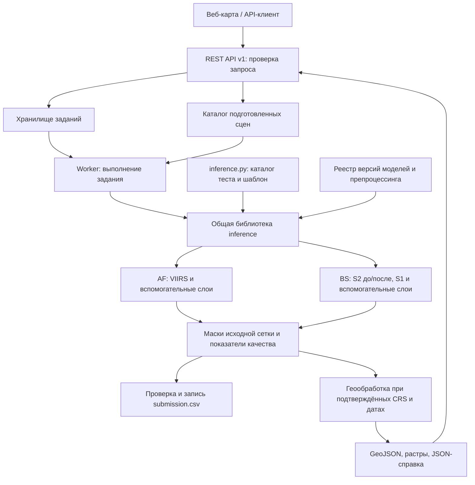

# FireWatch: архитектура и инструкции взаимодействия с моделями через API

Версия спецификации: **1.0, 19.09.2026**.

**Статус: архитектурный контракт.** Первоначально документ создан до реализации; сервис, конкурсный inference и модельный пакет затем разрабатывались параллельно. Текущие команды запуска, развёртывание и проверенные ограничения описаны в `README_SERVICE.md` и отчёте приёмки. Ниже разделены требования кейса, исходный интерфейс комплекта Colab и проектные решения. Примеры запросов и ответов иллюстративные, не результаты запуска модели.

## 1. Основание и границы

Источники — три PDF из предоставленного пользователем каталога документации. Они идентифицируются названиями и контрольными суммами ниже; локальный путь автора для запуска проекта не нужен.

| Источник | Использованные требования |
|---|---|
| «Постановка кейса — Мониторинг природных пожаров КосмоХакатон 2026», с. 3, 9–15 | Два модуля AF/BS, входные каналы, классы, обезличивание теста, RLE, CLI, сервис |
| «Критерии оценки — Мониторинг природных пожаров КосмоХакатон 2026», с. 3–6 | Метрики, воспроизводимость, обязательный REST API, геометрия и площади, время инференса |
| «Ссылка на данные», с. 1 | [Каталог организаторов](https://disk.yandex.ru/d/-rpmevTflbXZQg); фактический состав train описан в [README_MODEL.md](README_MODEL.md) и `artifacts/data_inspection.json` |

Контрольные суммы SHA-256 прочитанных PDF соответственно:

```text
Постановка: F5C78DD38524BBDFCB2AA4EA39F2DEA8EF1B36BC49991A7647BA22274F4FC156
Критерии:   2BF4D3148E2A499C1150C857D6287E06E5EE566C48219FAF8385EA6B9E33CCC3
Данные:    D438796D777A08E7ABCD159EC0641C9ED9C0EA31F4296CD6146D1C6D26DA45EB
```

Здесь под моделью понимается **модель сегментации спутниковых данных**. В постановке нет требования к LLM или внешнему провайдеру генеративного API. Основной путь должен работать с локальными весами и открытым бесплатным ПО. Генерация текста нейросетью не нужна для вычисления масок, классов и площадей.

Обязательный результат: AF-маска активного природного горения, BS-маска гари со степенью поражения, `submission.csv`, а также сервис с пространственно-временными запросами, картой термоточек, контурами и машиночитаемой справкой. Допустим заранее подготовленный ограниченный набор сцен; скачивание спутниковых данных по каждому запросу не требуется.

## 2. Архитектура

Предлагается один кодовый проект с общей библиотекой инференса и двумя точками входа: REST API для сервиса и автономный CLI для соревнования.



| Компонент | Ответственность | Предлагаемая реализация MVP |
|---|---|---|
| API | Валидация, авторизация, создание заданий, выдача результатов | FastAPI, типизированные схемы, `/openapi.json` |
| Каталог | Разрешённые наборы, файлы, каналы, сетки, даты, происхождение | Версионированные manifest-файлы; пути относительны `DATA_ROOT` |
| Задания | Статусы, идемпотентность, ошибки, таймауты | SQLite на одном хосте; транзакционный захват задания |
| Worker | Загрузка весов, подготовка данных, ограничение RAM/VRAM | Отдельный процесс, один исполнитель на GPU |
| Model runtime | Проверка совместимости и вызов AF/BS-адаптеров | Python/PyTorch; веса загружаются один раз на версию |
| Геообработка | Мозаика, векторизация, площади, экспорт | Rasterio и библиотеки геометрии/проекций |
| Артефакты | Маски, контуры, справки, контрольные суммы | Локальный каталог `ARTIFACT_ROOT` |
| CLI | Полный тестовый набор → валидный CSV | Использует ту же библиотеку без HTTP и карты |

Длительный инференс выполняет worker, а API возвращает идентификатор задания. Такое разделение согласуется с [рекомендациями FastAPI для тяжёлых фоновых вычислений](https://fastapi.tiangolo.com/tutorial/background-tasks/#caveat). Redis, Celery, объектное хранилище и несколько серверов для первого прототипа не обязательны. Версии зависимостей фиксируются при реализации и проверке окружения.

### Два независимых режима

1. **`competition`**: только выданные чипы и разрешённые метаданные; никакого восстановления координат, дат, запросов FIRMS и поиска исходных сцен. Результат — пиксельные маски/RLE. AF и BS обрабатываются независимо: обнаружение AF не является условием запуска BS.
2. **`geospatial_demo`**: отдельный подготовленный каталог с подтверждёнными датами и геопривязкой. По AOI и периоду возвращаются карта и площади. Для каждого набора документируется допустимость использования; обезличенный тест сюда не импортируется.

CLI должен работать без сетевых запросов с заранее размещёнными весами. API не должен превращать отсутствие геопривязки в вымышленные координаты.

## 3. Что уже есть в комплекте Colab

При проектировании проверен первоначальный комплект `FireWatch_Colab_full_training/firewatch_colab`, предоставленный отдельно. Этот раздел фиксирует его исходные ограничения. Текущий конкурсный runtime находится в `competition/` и описан в [README_MODEL.md](README_MODEL.md); старый комплект не требуется для запуска сервиса.

| Факт | Проверяемый источник относительно этого каталога |
|---|---|
| `predict_array(x, valid, run_dir, device="auto", tile_size=None)` | `firewatch_train/training.py`, строки 909–940 |
| `x`: исходные признаки `float32 [C,H,W]`; `valid`: `bool [H,W]`; нормализация внутри | Там же; порядок из checkpoint |
| Бинарная U-Net с одним выходным каналом | `firewatch_train/models.py`, строки 33–73 |
| Маска `uint8`: 0/1, 255 для непригодного наблюдения | `training.py`, `predict_array` |
| `score`: float32, NaN на invalid; это некалиброванный score | Там же, `score_is_calibrated_probability=False` |
| `best.pt` содержит веса, normalizer, config и выбранный порог | Там же; `README_RU.md`, раздел экспорта |
| Чтение тренировочной записи обращается к эталонной маске | `firewatch_train/data.py`, `read_record` — не применять этот загрузчик к тесту |
| CLI содержит prepare/train/evaluate/export | `firewatch_train/cli.py`; конкурсная `inference.py` ещё нужна |

CaBuAr использует 19 признаков строго в следующем порядке (`data.py`, строки 19–23):

```text
pre_B03, pre_B04, pre_B8A, pre_B11, pre_B12,
post_B03, post_B04, post_B8A, post_B11, post_B12,
nbr_pre, nbr_post, dnbr,
ndvi_pre, ndvi_post, dndvi,
nbr2_pre, nbr2_post, dnbr2
```

`spectral_features` получает выровненные HWC-массивы с объявленными именами каналов и проверенными `scale/offset`, затем строит CHW-признаки. В CaBuAr-данных используется масштаб 0.0001; перенос радиометрии на другой продукт проверяется отдельно. Числовая валидность этого комплекта не является маской облаков SCL.

**Бинарные веса CaBuAr не реализуют конкурсную классификацию 0–3 и не являются VIIRS-детектором.** Sen2Fire в комплекте также не заменяет AF-модель: другой сенсорный состав и слабая разметка. Переиспользовать можно каркас обучения, нормализацию, tiled inference и бинарный модуль гари после проверки переноса. Нельзя напрямую подавать конкурсный многоканальный растр в `predict_array` по совпадению размера.

Для завершения кейса нужны:

- AF-адаптер и модель под VIIRS I1–I5 и выданные вспомогательные слои;
- BS-адаптер и модель четырёх классов 0–3 либо проверенная связка «бинарная гарь + классификатор степени поражения»;
- загрузчик без чтения эталонных масок, конкурсный finalizer и RLE-экспорт;
- геопривязанный демонстрационный каталог и REST-обвязка.

Текущая функция `predict_array` загружает checkpoint и создаёт модель при каждом вызове. Для сервиса выделить `load` и `predict` и проверить совпадение результатов с исходной функцией. До этого нельзя обещать выигрыш от постоянно загруженных весов. Наличие обученных весов и их качество в этой работе не подтверждены.

## 4. Контракты входа и выхода модели

### 4.1. AF — активное горение

По постановке, с. 9–10: чип 256×256, сетка 375 м.

| Каналы по порядку | Единицы |
|---|---|
| I1, I2, I3 | Отражение, доли единицы |
| I4, I5 | Яркостная температура, K |
| Вспомогательный файл | Покров, высота, углы Солнца/сенсора, температура воздуха, влажность, ветер, маска валидности |

Имена и порядок полос вспомогательного файла, NoData и его единицы уточнить по реальному архиву; не угадывать по позиции. Выход конкурсного адаптера: `uint8 [256,256]`, только 0 и 1. Класс 1 — природное горение; техногенные источники относятся к 0. Использовать отрицательные примеры и доступные признаки; историю постоянных термоточек нельзя восстанавливать для обезличенного теста.

### 4.2. BS — гарь и степень поражения

По постановке, с. 9–10: чип 512×512, сетка 20 м. `pre` и `post` содержат:

```text
B2, B3, B4, B5, B6, B7, B8A, B11, B12, SCL
```

Первые девять полос: отражение L2A, `uint16`, масштаб 0–10000. Приведение к физическим долям — `/10000` в адаптере ровно один раз. SCL — категориальный слой; его не делить на 10000. B8A нельзя заменять B8. Имена B2/B02, B3/B03, B4/B04 привести к одной именованной схеме перед построением признаков.

Sentinel-1: VV/VH на обе даты, `int16`, σ⁰ в дБ ×100; перевод в дБ — `/100`. Преобразование в линейные значения допускается только если это предусмотрено версией признаков модели. Вспомогательные слои: высота, уклон, экспозиция и тип покрова.

Выход: `uint8 [512,512]`, один класс на пиксель:

| Класс | Значение |
|---|---|
| 0 | Фон, вне гари |
| 1 | Слабая степень поражения |
| 2 | Средняя степень поражения |
| 3 | Сильная степень поражения |

Для конкурсной маски, содержащей только 0–3, бинарная гарь вычисляется как `class_map > 0`. Для геосервиса и внутренних растров со служебным NoData использовать `observation_valid & isin(class_map, [1, 2, 3])`: 255 не является гарью. Три независимых бинарных порога без разрешения конфликтов недопустимы. Для четырёхклассовой головы применяется согласованный decoder; для двухступенчатой схемы severity присваивается только внутри гари. Пороги и правила фиксируются по validation с учётом типа покрова, а не подбираются по тестовым ответам.

### 4.3. Общие правила адаптера

1. Проверить число и порядок именованных каналов, dtype, единицы, размеры, согласованность сеток и доступность обязательных слоёв. Самовольно ресайзить конкурсные чипы или заполнять отсутствующий сенсор нулями нельзя.
2. Отдельно хранить `numeric_valid`, `observation_valid` и признаки облачности/теней. Построение признаков и масок наблюдения не использует ground truth. Применение SCL и SAR должно совпадать с обучением.
3. Нормализовать только статистиками train, записанными с весами. Зафиксировать обработку деления на ноль в индексах. Настройки тайлинга, перекрытия и восстановления исходного размера входят в версию модели.
4. Выполнять inference в `eval` без градиентов. Сохранять фактические device/precision и параметры, влияющие на результат.
5. Внутренний результат: `class_map [H,W]`, `observation_valid [H,W]`, при наличии `score`, а также модель, версии, threshold и предупреждения. `score` не называть вероятностью без калибровки.
6. Для геосервиса NoData сохраняется отдельно от фона; 255 допустим только как служебное значение растра, не как пожарный класс. В JSON нет NaN/Infinity: отсутствующие скаляры — `null`, массивы передаются файлами.
7. Для соревнования облачность не исключает пиксели из оценки. Finalizer обязан получить полный массив допустимых классов, включая облачные области. Политика заполнения/резервного предсказания разрабатывается и проверяется на validation; автоматическое `255 → 0` не считается обоснованной политикой. Если политика не определена, готовность конкурсного bundle не подтверждается.

### 4.4. Версия модели

Вводится immutable `model_bundle_id`: версия AF, BS, адаптеров и постобработки вместе. Manifest включает `schema_version`, список задач, SHA-256 весов, архитектуру, feature names, scale/offset, normalizer, классы, NoData/fallback, пороги, tile size/overlap, seed, версии кода и окружения, лицензию и происхождение весов.

API выбирает bundle из разрешённого реестра. Пользователь не передаёт путь к `.pt` и не меняет threshold в обычном запросе. Проверять список имён каналов, а не только их количество. Модель публикуется как доступная только после проверки артефактов и smoke inference. Экспериментальный бинарный CaBuAr-профиль может существовать отдельно, но не объявляется bundle с поддержкой AF+BS.

## 5. REST API v1

Базовый путь `/v1`, JSON UTF-8. Для закрытой установки внешний доступ — HTTPS и `Authorization: Bearer <token>`; токен задаётся окружением и не хранится в коде. По запросу пользователя на публичную демонстрацию добавлен отдельный явный режим `FIREWATCH_PUBLIC_DEMO=true`: без токена доступны только анализ зарегистрированных демонстрационных данных и результаты, с ограничениями тела запроса, частоты, очереди и времени исполнения. Загрузка произвольных файлов, обучение, установка весов и административные операции через публичный API отсутствуют. Без токена и без этого флага разрешён только loopback. Веб-интерфейс использует те же API-результаты и экспортируемые слои, что и внешний клиент.

| Метод и путь | Назначение | Успех |
|---|---|---|
| `GET /health/live` | Процесс API отвечает | 200 |
| `GET /health/ready` | Доступны worker, каталог и настроенные обязательные модели | 200; иначе 503 |
| `GET /v1/models` | Доступные bundle, задачи, версии и ограничения | 200 |
| `GET /v1/catalog` | Доступные dataset_id, покрытие/даты demo-наборов, ревизия каталога | 200 |
| `POST /v1/analyses` | Анализ AOI и периода по подготовленным сценам | 202 + `Location` |
| `POST /v1/predictions` | Непосредственный inference выбранных чипов каталога | 202 + `Location` |
| `GET /v1/jobs/{job_id}` | Статус и прогресс задания | 200 |
| `GET /v1/jobs/{job_id}/result` | Итоговый JSON после успеха | 200; до завершения 409 |
| `GET /v1/jobs/{job_id}/artifacts/{artifact_id}` | Скачивание принадлежащего заданию файла | 200 |

`GET /v1/models` сообщает для каждого bundle `id`, `tasks`, `ready`, `experimental`, `input_schema_version`, `weights_sha256` по задачам и поддерживаемый режим. Не выдавать несуществующие модели как готовые. `GET /v1/catalog` не раскрывает файловые пути и скрытые метаданные теста; клиент видит только доступные ему наборы.

### 5.1. Запрос анализа территории

```json
{
  "dataset_id": "demo-scenes-v1",
  "model_bundle_id": "competition-v1",
  "aoi": {"bbox": [38.10, 48.10, 38.20, 48.20]},
  "period": {
    "start": "2024-07-01T00:00:00Z",
    "end": "2024-08-01T00:00:00Z"
  },
  "tasks": ["af", "bs"]
}
```

Координаты и дата в примере условные и не обозначают наличие сцены или разрешение использовать эту территорию для обучения.

| Поле | Контракт |
|---|---|
| `dataset_id` | Зарегистрированный разрешённый `geospatial_demo`-набор |
| `model_bundle_id` | Конкретная неизменяемая версия с поддержкой запрошенных задач |
| `aoi` | Ровно одно из `bbox` или `geometry` |
| `bbox` | `[west, south, east, north]`, конечные числа в градусах, west < east, south < north |
| `geometry` | GeoJSON Geometry типа Polygon/MultiPolygon, валидные замкнутые кольца, ненулевая площадь |
| `period` | RFC3339 с часовым поясом; сервер приводит к UTC, интервал `[start,end)`, start < end |
| `tasks` | Непустой список уникальных значений `af`, `bs` |

Координаты GeoJSON — WGS84, **долгота, широта** (CRS84); [RFC 7946](https://www.rfc-editor.org/rfc/rfc7946) задаёт этот порядок и систему координат. Для MVP AOI с пересечением антимеридиана отклоняется с 422. Неизвестные поля запрещены. Допустимые площадь AOI, число вершин, длина периода, число чипов и число сцен задаются конфигурацией и публикуются в поле `limits` ответа `GET /v1/catalog`; численные лимиты выбрать после замеров.

Правила выбора сцен фиксируются версией каталога:

- AF: пространственное пересечение AOI и время съёмки в `[start,end)`.
- BS: только заранее проверенные пары `pre < post`, время `post` в `[start,end)`; `pre` может быть раньше начала интервала. Это оценка изменения между указанными датами, а не доказательство точной даты пожара. Реальные даты обеих оптических и SAR-съёмок включаются в результат.
- Список выбранных сцен и ревизия каталога сохраняются при приёме задания. Дальнейшее обновление каталога не меняет уже принятое задание.
- Нет подходящих сцен — результат `no_data`; модель недоступна — ошибка 503, а не пустая карта.

### 5.2. Непосредственный вызов модели для чипов

```json
{
  "dataset_id": "competition-test-v1",
  "model_bundle_id": "competition-v1",
  "chip_ids": ["AF_te_000001", "BS_te_000001"]
}
```

Чипы заранее регистрирует оператор из проверенного каталога. Тип `af`/`bs` определяется по manifest и `meta.csv`, а не только по префиксу имени. Идентификаторы должны быть уникальными, существовать и укладываться в лимит запроса. Нельзя передавать абсолютные пути, произвольные URL или массивы мегапикселей в JSON. Импорт новых данных — отдельная административная операция вне публичного inference API.

Ответ содержит ссылки на маски и RLE для выбранных чипов. Для обезличенного набора `georeferenced=false`; отсутствуют координаты и даты. Полный соревновательный CSV собирает CLI по всем строкам шаблона, а не по произвольному списку из HTTP-запроса.

### 5.3. Задания, повторы и завершение

Оба POST требуют `Idempotency-Key`, уникальный в пределах клиента. Сервер сохраняет ключ и канонический hash запроса транзакционно вместе с job. Повтор того же тела с тем же ключом возвращает тот же job; другое тело — 409 `IDEMPOTENCY_CONFLICT`. Ключ хранится не меньше срока жизни задания и артефактов. После сетевого таймаута повторять исходный POST с тем же ключом.

Пример принятого задания; HTTP 202, `Location: /v1/jobs/job_001`, `Retry-After: 2`:

```json
{
  "schema_version": "1.0",
  "job_id": "job_001",
  "kind": "analysis",
  "status": "queued",
  "status_url": "/v1/jobs/job_001",
  "result_url": "/v1/jobs/job_001/result"
}
```

Состояния: `queued → running → succeeded | failed`. Статус `succeeded` означает, что выходы проверены и опубликованы атомарно. `GET job` возвращает `progress` от 0 до 1, `stage`, `created_at`, `started_at`, `finished_at`, `error` (null при отсутствии) и те же ссылки. Прогресс отражает выполненные сцены/этапы; не обещает точного времени окончания.

Worker использует heartbeat и lease. После потери lease допускается ограниченное повторное выполнение в новом временном каталоге; результат публикуется только владельцем актуального lease. Частичные файлы не видны клиенту. Есть конечные лимиты ожидания в очереди, исполнения и повторов; при исчерпании — `failed` с `QUEUE_TIMEOUT`, `JOB_TIMEOUT` или `WORKER_LOST`. Остановка по таймауту должна прерывать работу, а не только менять запись в БД.

При исчерпании памяти допустимо уменьшение batch/tile только по заранее проверенной политике bundle с записью фактических параметров. Смена модели, precision или устройства без отражения в provenance запрещена. Если безопасный повтор невозможен — `MODEL_EXECUTION_FAILED`.

### 5.4. Результат анализа

HTTP 200 после завершения. Пример для задачи с обоими модулями; все числа условные:

```json
{
  "schema_version": "1.0",
  "job_id": "job_001",
  "kind": "analysis",
  "data_status": "complete",
  "model_bundle_id": "competition-v1",
  "catalog_revision": "demo-v1",
  "modules": {
    "af": {"data_status": "complete", "hotspot_count": 2},
    "bs": {
      "data_status": "complete",
      "burn_area_ha": 1.2,
      "severity_area_ha": {"1": 0.4, "2": 0.6, "3": 0.2}
    }
  },
  "quality": {
    "af": {
      "observed_area_ha": 8250.0,
      "unobserved_area_ha": 0.0,
      "coverage_fraction": 1.0,
      "cloud_fraction": null,
      "observation_count": 1
    },
    "bs": {
      "observed_area_ha": 8250.0,
      "unobserved_area_ha": 0.0,
      "coverage_fraction": 1.0,
      "cloud_fraction": 0.0,
      "observation_count": 1
    },
    "warnings": []
  },
  "artifacts": [
    {"id": "hotspots", "media_type": "application/geo+json", "href": "/v1/jobs/job_001/artifacts/hotspots"},
    {"id": "burn_polygons", "media_type": "application/geo+json", "href": "/v1/jobs/job_001/artifacts/burn_polygons"},
    {"id": "summary", "media_type": "application/json", "href": "/v1/jobs/job_001/artifacts/summary"},
    {"id": "provenance", "media_type": "application/json", "href": "/v1/jobs/job_001/artifacts/provenance"}
  ]
}
```

Незапрошенные модули отсутствуют. Для каждого запрошенного модуля обязательны `data_status` и его числовые поля. Значения `data_status`:

- `complete`: пригодное покрытие всей AOI выбранными наблюдениями для данного модуля;
- `partial`: рассчитана только часть AOI; площади относятся к наблюдаемой части, не экстраполируются;
- `no_data`: пригодных наблюдений нет; счётчики и площади этого модуля — `null`, а не 0.

Общий статус — `complete`, если все запрошенные модули complete; `no_data`, если все no_data; в остальных случаях partial. При обработанной территории без обнаружений счётчики и площади равны 0, GeoJSON содержит `features: []`. Непригодные наблюдения и отсутствие пожара различаются.

Для каждого запрошенного модуля поля `quality` обязательны. `observed_area_ha + unobserved_area_ha` равно площади AOI; `coverage_fraction` — отношение наблюдаемой площади к площади AOI. `observation_count` — число выбранных AF-сцен или BS-пар. `cloud_fraction` — доля облачных пикселей выбранных наблюдений внутри AOI до построения итоговой мозаики; при отсутствии подтверждённой QA равна null. При no_data наблюдаемая площадь и покрытие равны 0; сама площадь AOI остаётся известной.

`provenance` содержит исходный запрос, список сцен с датами/CRS и checksums, версии моделей/адаптеров, hashes весов, frozen thresholds, правила выбора/объединения, обработку NoData, способ расчёта площади, фактические device/precision, время стадий и предупреждения. Здесь же хранится manifest остальных артефактов с SHA-256, размером в байтах и `expires_at`; checksum самого provenance отдаётся HTTP-заголовком `ETag` в документированном формате SHA-256. Хэши и происхождение фиксируются и для нулевого результата.

### 5.5. Результат предсказания чипов

```json
{
  "schema_version": "1.0",
  "job_id": "job_002",
  "kind": "prediction",
  "model_bundle_id": "competition-v1",
  "items": [
    {
      "chip_id": "AF_te_000001",
      "task": "af",
      "height": 256,
      "width": 256,
      "georeferenced": false,
      "classes": [0, 1],
      "mask_url": "/v1/jobs/job_002/artifacts/AF_te_000001_mask",
      "rle": [{"class_id": 1, "rle": ""}]
    },
    {
      "chip_id": "BS_te_000001",
      "task": "bs",
      "height": 512,
      "width": 512,
      "georeferenced": false,
      "classes": [0, 1, 2, 3],
      "mask_url": "/v1/jobs/job_002/artifacts/BS_te_000001_mask",
      "rle": [
        {"class_id": 1, "rle": ""},
        {"class_id": 2, "rle": ""},
        {"class_id": 3, "rle": ""}
      ]
    }
  ],
  "provenance_url": "/v1/jobs/job_002/artifacts/provenance"
}
```

Это пример фоновых масок для проверки транспорта. В реальном ответе маски и RLE должны декодироваться в одно и то же предсказание. Негеопривязанные маски передаются как `.npy` uint8 без pickle; геопривязанные — GeoTIFF с истинными CRS/transform. Ссылки авторизуются так же, как само задание. Артефакты имеют SHA-256, размер и срок хранения в manifest результата; истёкший результат возвращает 410.

### 5.6. Ошибки

Общий JSON для синхронной ошибки; та же структура объекта `error` используется в failed job:

```json
{
  "error": {
    "code": "INPUT_SCHEMA_MISMATCH",
    "message": "BS input is missing required band B8A",
    "details": {"field": "bands", "missing": ["B8A"]},
    "retryable": false
  },
  "request_id": "req_001"
}
```

| HTTP | Коды/ситуации | Действие клиента |
|---|---|---|
| 401/403 | Нет доступа | Исправить авторизацию |
| 404 | Неизвестное задание, чип или набор | Проверить идентификатор |
| 409 | `IDEMPOTENCY_CONFLICT`, `RESULT_NOT_READY`, `JOB_FAILED` | Проверить тело/статус; не создавать дубликат автоматически |
| 410 | Артефакты удалены по сроку хранения | Запросить новое задание при необходимости |
| 413 | Превышен лимит тела запроса | Уменьшить запрос |
| 422 | `INVALID_AOI`, `INVALID_PERIOD`, `INPUT_SCHEMA_MISMATCH`, `UNSUPPORTED_TASK`, `GEOREFERENCE_REQUIRED` | Исправить вход; повтор без изменений бесполезен |
| 429 | Очередь заполнена/лимит клиента | Повтор с тем же ключом после `Retry-After` |
| 503 | `MODEL_NOT_READY`, недоступен worker/каталог | Проверить ready; ограниченный повтор |
| 500 | Внутренняя ошибка | Сохранить request_id; ограниченный повтор по политике |

Если ошибка обнаружена после HTTP 202, она записывается в job; `GET job` остаётся HTTP 200 со статусом failed. Логи не содержат токенов, входных raster-массивов и внутренних путей в пользовательском сообщении.

## 6. Карта, векторы и площади

**Геопривязка — отдельный обязательный контракт каталога.** Нужны CRS, affine transform, размеры, время съёмки, footprint и подтверждённое происхождение. Наличие `gsd` или номера патча само по себе координат не даёт.

- AF: Point в центре каждого исходного пикселя, где `observation_valid & (class_map == 1)`. Атрибуты: `hotspot_id`, `scene_id`, `observed_at`, `model_bundle_id`, `score` (null при отсутствии). Сохранять размер исходного пикселя. Термоточка 375 м не означает, что горят все 14.0625 га пикселя; площадь гари по AF не рассчитывать.
- Повторные AF-наблюдения одной области в разные пролёты сохраняются как разные наблюдения. Дубликаты перекрывающихся чипов одной съёмки устраняются по ключу `(scene_id, global_row, global_col)` исходной сетки сцены, не по локальному row/col чипа. Каталог должен хранить проверенное смещение чипа в этой сетке. Среди пригодных предсказаний одного пикселя выбрать чип с наибольшим расстоянием до его границы, при равенстве — наименьший стабильный `chip_id`. Выбор выполняется до фильтрации класса 1 и одинаков для положительных и фоновых предсказаний. Если ни одного пригодного предсказания нет, пиксель остаётся NoData. Правило входит в версию постобработки. `hotspot_count` — число таких наблюдений, а не число уникальных пожаров.
- BS: GeoJSON FeatureCollection с Polygon/MultiPolygon для каждого класса 1–3. Атрибуты: `contour_id`, `class_id`, `severity`, `area_ha`, `date_pre`, `date_post`, `source_scene_ids`, `model_bundle_id`. Допустим GeoJSON как единственный обязательный векторный экспорт; Shapefile — расширение, не отдельный gate MVP.
- Векторизовать дискретную маску на исходной сетке с явно заданной связностью 4 и истинным transform. [Rasterio](https://rasterio.readthedocs.io/en/stable/topics/features.html) без transform возвращает координаты пикселей, поэтому такой результат нельзя выдавать как карту.
- Для перекрывающихся BS-результатов построить единственную итоговую карту классов: на каждом участке выбрать самое позднее пригодное `post` из интервала; при равенстве — наименьший стабильный `scene_id`. Правило одинаково для всех классов и записано в provenance. Это сводка последних наблюдений, а не сумма площадей пожаров за все даты. Историю хранить отдельно.
- AOI обрезает итоговые контуры. Площадь вычислять по той же несглаженной геометрии, которая выдана клиенту: в подходящей равновеликой проекции с зафиксированными параметрами. Не использовать квадратные градусы или Web Mercator для площади. При необходимости перепроецирования карт классов использовать nearest neighbour и фиксированную целевую сетку; итоговые области не пересекаются.
- Для контрольного подсчёта полного пикселя в метрической affine-сетке его площадь равна `abs(a*e - b*d)` м²; для сетки 20×20 м номинально 0.04 га. Такой подсчёт не заменяет учёт искажений проекции и частичного пересечения границы AOI. Контроль сравнивается с итоговой геометрической площадью в пределах явно установленного допуска.
- Обязательный инвариант: `burn_area_ha = area_1 + area_2 + area_3`; также сумма `area_ha` контуров каждого класса равна сводке. Считать до округления, округлять только представление. NoData не включается в фон или гарь и показывается в покрытии.

Машиночитаемая справка содержит эти площади, период наблюдений, покрытие и ссылки на provenance. UI отображает те же GeoJSON поверх подложки и предоставляет скачивание справки; собственные независимые расчёты площадей во frontend не нужны.

## 7. Конкурсный CLI и RLE

Требуемая организаторами точка входа:

```bash
python inference.py --data-dir /path/to/test --output /path/to/submission.csv
```

Команда задаёт конкурсный контракт; актуальные параметры существующего `inference.py` приведены в [README_MODEL.md](README_MODEL.md). Порядок работы: прочитать `sample_submission.csv` → определить все чипы → проверить входы → загрузить фиксированный bundle → AF/BS inference → конкурсный finalizer → проверка RLE → атомарная запись CSV → exit 0. Ошибка чипа не заменяется молча пустой маской: весь запуск завершается ненулевым кодом, финальный CSV не публикуется.

Требования постановки, с. 12:

- UTF-8, запятая, заголовок `chip_id,class_id,rle`.
- AF: строка класса 1; BS: строки классов 1, 2, 3. Фон 0 не кодируется.
- Пары `(chip_id,class_id)` совпадают с шаблоном без дубликатов. В документированной версии 447 строк: 180 AF + 89×3 BS. Источник истины при запуске — фактический шаблон, без жёсткого ограничения на 447.
- RLE: построчное разворачивание C-order слева направо и сверху вниз; индексы с 1, пары `start length` по возрастанию. Длины положительные, серии не пересекаются и соседние серии объединены, последний индекс не больше `H*W`.
- RLE заключён в двойные кавычки; отсутствие класса — `""`, не NaN/null/отсутствующая ячейка. При чтении библиотекой отключить превращение пустой RLE-строки в NaN.
- Маски BS-классов взаимно не пересекаются; пиксель вне всех трёх масок — фон. NoData=255 не может попасть в CSV.

Контрольный пример 2×3: строки `[0,1,1]`, `[0,0,1]` дают `"2 2 6 1"`. Этот пример проверяет порядок обхода и индексацию, но не заменяет сверку с кодировщиком организаторов.

Качество оценивать официальным скриптом:

```text
Score = 0.35 * F1_af + 0.35 * IoU_burn + 0.30 * mIoU_sev
mIoU_sev = (IoU_1 + IoU_2 + IoU_3) / 3
```

TP/FP/FN суммируются по всем чипам до вычисления метрик. `IoU_burn` считает объединение классов 1–3. Использовать `F1 = 2*TP / (2*TP + FP + FN)` и `IoU = TP / (TP + FP + FN)`. По постановке, с. 13, при нулевом знаменателе соответствующая метрика равна 1; если класс есть в эталоне, но полностью отсутствует в предсказании, его IoU равен 0. Эти случаи явно сверить с официальным scorer, включая вклад отсутствующего класса в среднее трёх IoU. Validation разделяется по пожарам (`fire_event_id`), с проверкой переноса между территориями/сезонами. Тест не используется для нормализации, порогов и выбора модели.

## 8. Инструкция API-клиенту

1. Проверить `/health/ready`, выбрать доступные `dataset_id` и `model_bundle_id` через каталог и реестр моделей.
2. Для карты отправить `/v1/analyses`; для масок зарегистрированных чипов — `/v1/predictions`. Не отправлять изображения в текстовом prompt и не передавать пути машины клиента.
3. Сохранить `Idempotency-Key` до первого POST. При неясном результате сети повторять с тем же ключом.
4. Получить `job_id`; опрашивать `status_url` с учётом `Retry-After` и ограничением общего времени ожидания.
5. При failed прочитать `error`. При succeeded получить `result_url`, проверить `data_status` и предупреждения, скачать нужные артефакты.
6. Для отчёта использовать числа API вместе с покрытием и датами. `no_data` не интерпретировать как «пожаров нет».

Пример Python-клиента (требуется `requests`). `FIREWATCH_BASE_URL` и `FIREWATCH_IDEMPOTENCY_KEY` задаются окружением; последний ключ должен сохраняться при повторе того же запроса. `FIREWATCH_TOKEN` нужен для закрытой установки. Идентификаторы и AOI в примере иллюстративные: действующие значения берутся из `/v1/catalog` и `/v1/models`. Готовый пример для подготовленного набора приведён в [README_SERVICE.md](README_SERVICE.md).

```python
import os
import time
import requests

base = os.environ["FIREWATCH_BASE_URL"].rstrip("/")
session = requests.Session()
if os.getenv("FIREWATCH_TOKEN"):
    session.headers["Authorization"] = "Bearer " + os.environ["FIREWATCH_TOKEN"]
payload = {
    "dataset_id": "demo-scenes-v1",
    "model_bundle_id": "competition-v1",
    "aoi": {"bbox": [38.10, 48.10, 38.20, 48.20]},
    "period": {
        "start": "2024-07-01T00:00:00Z",
        "end": "2024-08-01T00:00:00Z",
    },
    "tasks": ["af", "bs"],
}
response = session.post(
    base + "/v1/analyses", json=payload,
    headers={"Idempotency-Key": os.environ["FIREWATCH_IDEMPOTENCY_KEY"]},
    timeout=(5, 30),
)
response.raise_for_status()
job = response.json()
deadline = time.monotonic() + 600  # Лимит ожидания клиента, не SLA сервиса.
while time.monotonic() < deadline:
    response = session.get(base + job["status_url"], timeout=(5, 30))
    response.raise_for_status()
    state = response.json()
    if state["status"] == "failed":
        raise RuntimeError(state["error"])
    if state["status"] == "succeeded":
        result = session.get(base + job["result_url"], timeout=(5, 30))
        result.raise_for_status()
        print(result.json())
        break
    time.sleep(min(30, max(1, int(response.headers.get("Retry-After", "2")))))
else:
    raise TimeoutError("Client wait expired; retain job_id and continue polling later")
```

API возвращает относительные URL того же сервера. Истечение времени ожидания клиента само по себе не отменяет серверное задание.

## 9. Реализованная структура

Сервис и конкурсный CLI используют общую библиотеку модели. Изолированный worker запускается для каждого задания; кэш модели действует внутри процесса, между заданиями процесс создаётся заново для надёжного таймаута.

```text
MODEL_API.md
inference.py                  # Конкурсная точка входа
train.py                      # Воспроизводимая точка входа обучения
firewatch_service/
  api.py                      # REST, авторизация, очередь, артефакты
  schemas.py                  # Типизированные запросы и валидация
  config.py                   # Переменные окружения и лимиты
  jobs.py                     # SQLite, идемпотентность, изоляция worker
  catalog.py                  # Подготовленные наборы и реестр моделей
  processing.py               # AOI/даты, вызов bridge, GeoJSON и площади
competition/
  data.py                     # Входные признаки AF/BS без чтения labels
  service_bridge.py           # Общий API runtime, manifest и веса
  rle.py                      # C-order RLE и проверка пересечений
  tree.py, models.py, train.py # Обучение и модельные backend
web/                          # Карта, параметры, отчёт и скачивание
deploy/                       # systemd, nginx, SSH relay, release/rollback
tools/prepare_service_demo.py # Импорт разрешённых геопривязанных сцен
tools/check_service_e2e.py    # Проверка реального развёрнутого API
tests/service/                # Контракты API и геообработки
README_SERVICE.md             # Актуальная инструкция оператора/API
README_MODEL.md               # Обучение и конкурсный CLI
```

Окружение: `FIREWATCH_DATA_ROOT`, `FIREWATCH_MODEL_ROOT`, `FIREWATCH_ARTIFACT_ROOT`, `FIREWATCH_JOB_DB`, `DEVICE`, `FIREWATCH_TOKEN`, `FIREWATCH_PUBLIC_DEMO`, лимиты очереди/исполнения. Шаблон — `deploy/service.env.example`. CPU-инференс проверяется отдельно от GPU-обучения; установка зависимостей сама по себе не доказывает совместимость checkpoint.

## 10. Приёмка и незакрытые вопросы

| Gate | Фактическая проверка, необходимая при реализации |
|---|---|
| Совместимость входа | Реальные AF/BS-чипы: band order, scale/offset, NoData, сетки; несовместимый bundle отвергается |
| Изоляция инференса | Предсказание без эталонных масок; отсутствие скрытых test-метаданных и внешней сети в competition |
| Модели | AF выдаёт 0/1; BS выдаёт 0–3; сопоставление с baseline и официальным scorer |
| Маски и облачность | Негорящий чип, малый очаг, три степени, облака/тени, полностью непригодное наблюдение, границы тайлов |
| RLE/CSV | Round trip C-order, пустые классы, границы индексов, точное множество строк шаблона, отсутствие пересечений; полный тест проходит валидатор организаторов |
| CLI/API | Для одинакового bundle и входов маски совпадают; API не меняет thresholds или препроцессинг |
| Геометрия | CRS, AOI clip, отверстия, перекрывающиеся сцены/даты, сумма площадей, NoData отдельно от фона |
| REST | Идемпотентный повтор, 422, unavailable model, no_data, failed worker, восстановление lease, timeout, защита артефактов |
| Воспроизводимость | Зафиксированы код, зависимости, веса, seed; изменение Score повторного запуска не больше 0.005 |
| Скорость | Замер полного CLI с загрузкой весов и препроцессингом на целевом железе; HTTP latency не подменяет этот замер |
| Демонстрация | Реальный запрос AOI+период, карта и выгрузка контуров/справки с одними и теми же данными через UI и REST |

Исходные вопросы проектирования (их актуальное состояние фиксируется в README и отчётах проверок):

1. Получить и проверить актуальный архив организаторов: реальные имена файлов и вспомогательных полос, official baseline/scorer, template, единицы и политика NoData. Проверить обновления постановки в канале организаторов.
2. Выбрать и обучить/адаптировать AF и BS модели. Существующий бинарный комплект не закрывает эти gates. Фиксировать происхождение и допустимость внешних обучающих данных; неизвестные пересечения с тестом не считать автоматически исключёнными.
3. Подготовить разрешённые геопривязанные demo-сцены. Чипы без геопривязки не подходят для доказательства корректности карты и площадей.
4. Согласовать policy облачности/fallback и перенос CaBuAr-радиометрии; подтвердить метриками на validation.
5. Измерить ресурсы и установить лимиты AOI, сцен, batch, очереди, времени и хранения. В таблице критериев есть нерасписанный интервал времени более 30 минут до часа; трактовку баллов уточнить у организаторов, не придумывать.

Первоначальная версия документа проверяла требования трёх PDF и интерфейс Colab. Прохождение gates подтверждается отдельными фактическими результатами запуска; примеры этого документа не являются такими доказательствами. Сервисные проверки, обучение, конкурсная оценка и полный CLI имеют разный scope и не заменяют друг друга.
