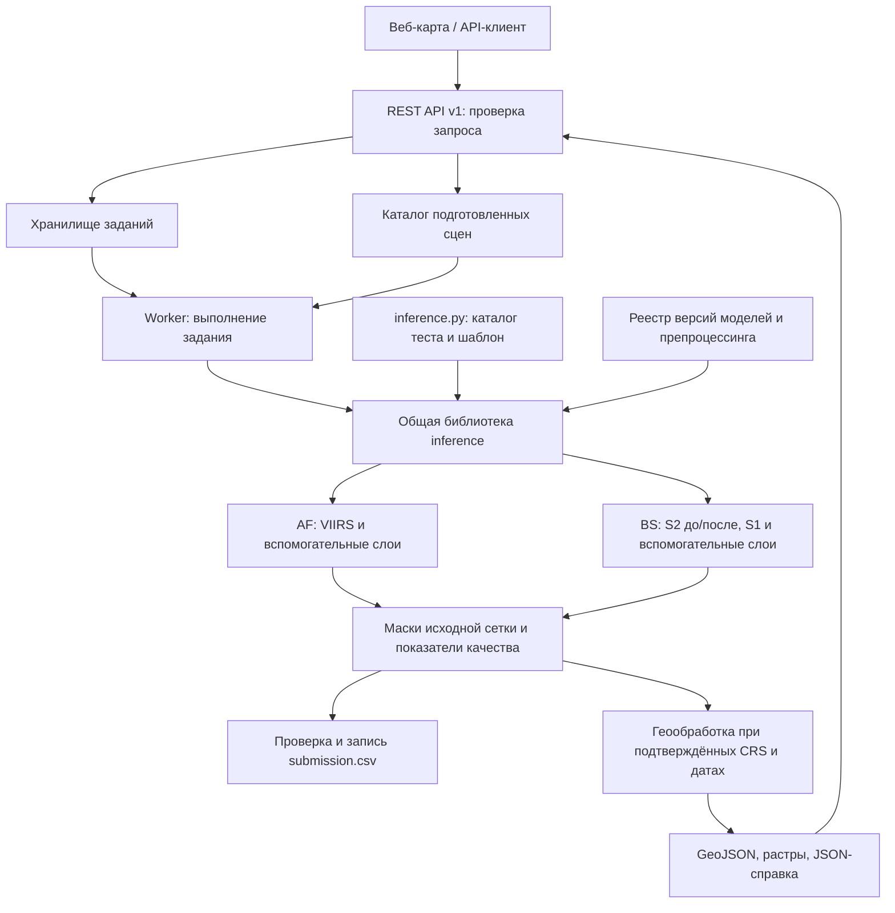

# FireWatch: архитектура и инструкции взаимодействия с моделями через API

Версия документа: **1.2, 19.09.2026**. Версия HTTP API: **v1**.

**Назначение:** архитектура взаимодействия с моделями AF/BS и инструкция для разработчика API-клиента. Требования сверены с тремя PDF пользователя, HTTP-контракты — с текущими `firewatch_service/api.py`, `schemas.py`, `catalog.py`, `jobs.py` и `processing.py`; модельный интерфейс — с `competition/service_bridge.py` и `data.py`. Команды установки и развёртывания находятся в [README_SERVICE.md](README_SERVICE.md). Примеры результатов ниже иллюстрируют структуру, а не измеренное качество модели. Начало интеграции — раздел 8.

## 1. Основание и границы

Источники — три PDF из предоставленного пользователем каталога документации. Они идентифицируются названиями и контрольными суммами ниже; локальный путь автора для запуска проекта не нужен.

| Источник | Использованные требования |
|---|---|
| «Постановка кейса — Мониторинг природных пожаров КосмоХакатон 2026», с. 3, 9–15 | Два модуля AF/BS, входные каналы, классы, обезличивание теста, RLE, CLI, сервис |
| «Критерии оценки — Мониторинг природных пожаров КосмоХакатон 2026», с. 3–6 | Метрики, воспроизводимость, обязательный REST API, геометрия и площади, время инференса |
| «Ссылка на данные», с. 1 | [Каталог организаторов](https://disk.yandex.ru/d/-rpmevTflbXZQg); фактический состав train описан в [README_MODEL.md](README_MODEL.md) и `artifacts/data_inspection.json` |

Контрольные суммы SHA-256 прочитанных PDF соответственно:

```text
Постановка: F5C78DD38524BBDFCB2AA4EA39F2DEA8EF1B36BC49991A7647BA22274F4FC156
Критерии:   2BF4D3148E2A499C1150C857D6287E06E5EE566C48219FAF8385EA6B9E33CCC3
Данные:    D438796D777A08E7ABCD159EC0641C9ED9C0EA31F4296CD6146D1C6D26DA45EB
```

Здесь под моделью понимается **модель сегментации спутниковых данных**. В постановке нет требования к LLM или внешнему провайдеру генеративного API. Основной путь должен работать с локальными весами и открытым бесплатным ПО. Генерация текста нейросетью не нужна для вычисления масок, классов и площадей.

Обязательный результат: AF-маска активного природного горения, BS-маска гари со степенью поражения, `submission.csv`, а также сервис с пространственно-временными запросами, картой термоточек, контурами и машиночитаемой справкой. Допустим заранее подготовленный ограниченный набор сцен; скачивание спутниковых данных по каждому запросу не требуется.

## 2. Архитектура

Используется один кодовый проект с общей библиотекой инференса и двумя точками входа: REST API для сервиса и автономный CLI для соревнования.



| Компонент | Ответственность | Текущая реализация |
|---|---|---|
| API | Валидация, авторизация, создание заданий, выдача результатов | FastAPI, типизированные схемы, `/openapi.json` |
| Каталог | Разрешённые наборы, файлы, каналы, сетки, даты, происхождение | Версионированные manifest-файлы; пути относительны `DATA_ROOT` |
| Задания | Статусы, идемпотентность, ошибки, таймауты | SQLite на одном хосте; транзакционное создание задания |
| Worker | Загрузка весов, подготовка данных, принудительный таймаут | Новый изолированный процесс для каждого задания; по умолчанию один исполнитель |
| Model runtime | Проверка совместимости и вызов AF/BS-адаптеров | LightGBM, PyTorch или ансамбль по manifest; кэш весов внутри процесса задания |
| Геообработка | Мозаика, векторизация, площади, экспорт | Rasterio и библиотеки геометрии/проекций |
| Артефакты | Маски, контуры, справки, контрольные суммы | Локальный каталог `ARTIFACT_ROOT` |
| CLI | Полный тестовый набор → валидный CSV | Использует ту же библиотеку без HTTP и карты |

Длительный инференс выполняет worker, а API возвращает идентификатор задания. API запускается **одним процессом Uvicorn (`--workers 1`)**: очередь исполнения и восстановление состояния рассчитаны на этот режим. Число параллельных дочерних процессов задаёт `FIREWATCH_MAX_WORKERS`. Версии зависимостей закреплены в `requirements-service.txt` и `deploy/requirements-cpu.txt`. Переход к нескольким процессам API потребует отдельного механизма захвата заданий и координации очереди.

### Два независимых режима

1. **`competition`**: только выданные чипы и разрешённые метаданные; никакого восстановления координат, дат, запросов FIRMS и поиска исходных сцен. Результат — пиксельные маски/RLE. AF и BS обрабатываются независимо: обнаружение AF не является условием запуска BS.
2. **`geospatial_demo`**: отдельный подготовленный каталог с подтверждёнными датами и геопривязкой. По AOI и периоду возвращаются карта и площади. Для каждого набора документируется допустимость использования; обезличенный тест сюда не импортируется.

CLI должен работать без сетевых запросов с заранее размещёнными весами. API не должен превращать отсутствие геопривязки в вымышленные координаты.

## 3. Внутренний интерфейс модели

Общий интерфейс реализован в `competition/service_bridge.py`:

| Вызов | Назначение |
|---|---|
| `describe_models(model_dir=None)` | Проверяет manifest, версию признаков, наличие и SHA-256 всех весов; возвращает `available`, `bundle_id`, `tasks` |
| `predict_chip(dataset_root, chip_id, bundle_id=None, model_dir=None)` | Читает входные TIFF одного чипа без эталонной маски и получает предсказание |
| `predict_features(chip, model_dir=None, bundle_id=None)` | Инференс уже подготовленного объекта `Chip` |

Сервис всегда передаёт конкретные `bundle_id` и `model_dir`. Загрузка использует кэш по разрешённому пути, задаче и SHA-256 manifest; между HTTP-заданиями кэш не сохраняется, поскольку процесс worker создаётся заново. Обучение и установка весов выполняются отдельно от запросов API.

Внутренний результат — словарь:

```text
class_map: uint8[H,W]             # AF: 0/1; BS: 0/1/2/3
observation_valid: bool[H,W]      # Пригодность для географического отчёта
score: float32[H,W] или [4,H,W]  # AF или BS; не калиброванная вероятность
provenance: dict                  # Bundle, backend, device, feature version, hashes
```

`class_map` содержит предсказание для каждого пикселя, включая облачные. Геосервис применяет `observation_valid` при построении карты и покрытия; конкурсный CLI и endpoint сырых масок сохраняют полный `class_map`. Это разделение предотвращает попадание служебного NoData в конкурсный CSV.

## 4. Контракты входа и выхода модели

### 4.1. AF — активное горение

По постановке, с. 9–10: чип 256×256, сетка 375 м.

| Каналы по порядку | Единицы |
|---|---|
| I1, I2, I3 | Отражение, доли единицы |
| I4, I5 | Яркостная температура, K |
| Вспомогательный файл | Покров, высота, углы Солнца/сенсора, температура воздуха, влажность, ветер, маска валидности |

Фактическую схему уточняет текущий загрузчик `competition/data.py`: TIFF `VIIRS_I1-I5` имеет восемь именованных полос `I1, I2, I3, I4, I5, solar_zenith, sensor_zenith, valid`, а AF `AUX` — пять: `landcover, dem, t2m, rh2m, wind_speed`; оба файла — `float32`. Это отличается от размещения вспомогательных полос, обобщённо описанного в PDF. Проверяются точные `band descriptions`, размеры и совпадение сеток. Выход: `uint8 [256,256]`, только 0 и 1. Класс 1 — природное горение; техногенные источники относятся к 0.

### 4.2. BS — гарь и степень поражения

По постановке, с. 9–10: чип 512×512, сетка 20 м. `pre` и `post` содержат:

```text
B2, B3, B4, B5, B6, B7, B8A, B11, B12, SCL
```

Первые девять полос: отражение L2A, `uint16`, масштаб 0–10000. Приведение к физическим долям — `/10000` в адаптере ровно один раз. SCL — категориальный слой, отдельный числовой признак модели масштабируется через `/11`; на `/10000` он не делится. B8A нельзя заменять B8. Текущий загрузчик требует приведённые выше точные имена полос (`B2`, а не `B02`).

Sentinel-1: VV/VH на обе даты, `int16`, σ⁰ в дБ ×100; перевод в дБ — `/100`. Фактический BS `AUX` загрузчик ожидает как `int16` с полосами `dem, slope, landcover`. Экспозиция упомянута в PDF, но в текущую входную схему не входит; добавлять её без новой версии признаков нельзя. Все пять TIFF должны иметь одинаковые размеры, CRS и transform.

Выход: `uint8 [512,512]`, один класс на пиксель:

| Класс | Значение |
|---|---|
| 0 | Фон, вне гари |
| 1 | Слабая степень поражения |
| 2 | Средняя степень поражения |
| 3 | Сильная степень поражения |

Для конкурсной маски, содержащей только 0–3, бинарная гарь вычисляется как `class_map > 0`. Для геосервиса и внутренних растров со служебным NoData использовать `observation_valid & isin(class_map, [1, 2, 3])`: 255 не является гарью. Три независимых бинарных порога без разрешения конфликтов недопустимы. Для четырёхклассовой головы применяется согласованный decoder; для двухступенчатой схемы severity присваивается только внутри гари. Пороги и правила фиксируются по validation с учётом типа покрова, а не подбираются по тестовым ответам.

### 4.3. Общие правила адаптера

1. Проверить число и порядок именованных каналов, dtype, размеры, согласованность сеток и обязательные слои. Чтение и построение признаков выполняет `competition/data.py`; HTTP-клиент не повторяет препроцессинг.
2. Сохранить `observation_valid` отдельно от классов. Для AF это конечные значения I1–I5 и положительная полоса `valid`; для BS исключаются SCL 0, 1, 3, 8, 9, 10, 11 на обе даты. Эта маска используется для географического покрытия и не исключает пиксели из конкурсного предсказания.
3. Использовать версию признаков `official-named-v1`, точный порядок `feature_names` и сохранённые с весами параметры. CNN использует train mean/std; LightGBM — признаки своего обученного набора. Формулы масштабирования и обработки нечисловых значений определены в `data.py`.
4. PyTorch работает в `eval()` и `inference_mode()`; backend и устройство входят в provenance. AF применяет порог bundle, BS — argmax оценок четырёх классов с сохранёнными class multipliers. Параметры клиентом не переопределяются.
5. `class_map` и `observation_valid` имеют одинаковые размеры. `score` не является калиброванной вероятностью. GeoJSON и JSON-справка не должны содержать NaN/Infinity; отсутствующие скаляры — `null`.
6. Сырые маски для CLI и `/v1/predictions` содержат только допустимые классы. Отображаемый растр анализа территории может содержать NoData=255; это отдельный продукт. Для BS его гарь определяется через `observation_valid & isin(class_map, [1, 2, 3])`, а не `class_map > 0`.

### 4.4. Версия модели

Bundle публикуется как неизменяемый каталог с `manifest.json` и весами. Manifest содержит `bundle_id`, `feature_version`, задачи `af`/`bs`, backend, пути и SHA-256 файлов, параметры постобработки; состав ансамбля и его вес задаются явно. Имена признаков и нормализация хранятся в metadata LightGBM или checkpoint CNN. Изменение весов, признаков или порогов требует нового bundle ID и каталога.

Реестр проверяет совместимость feature version и целостность файлов. `status=ready` подтверждает эту проверку, но не качество и не успешную загрузку модели в целевое устройство; перед использованием нового bundle нужен реальный smoke inference. Для принятого задания сохраняются SHA-256 manifest и разрешённый путь к каталогу модели; новая публикация не должна подменять файлы этого каталога.

## 5. REST API v1

Базовый путь `/v1`, JSON UTF-8. Для закрытой установки внешний доступ — HTTPS и `Authorization: Bearer <token>`; токен задаётся окружением и не хранится в коде. По запросу пользователя на публичную демонстрацию добавлен отдельный явный режим `FIREWATCH_PUBLIC_DEMO=true`: без токена доступны только анализ зарегистрированных демонстрационных данных и результаты, с ограничениями тела запроса, частоты, очереди и времени исполнения. Загрузка произвольных файлов, обучение, установка весов и административные операции через публичный API отсутствуют. Без токена и без этого флага разрешён только loopback. Веб-интерфейс использует те же API-результаты и экспортируемые слои, что и внешний клиент.

| Метод и путь | Назначение | Успех |
|---|---|---|
| `GET /health/live` | Процесс API отвечает | 200 |
| `GET /health/ready` | Доступны worker, каталог и настроенные обязательные модели | 200; иначе 503 |
| `GET /v1/models` | Доступные bundle, задачи, версии и ограничения | 200 |
| `GET /v1/catalog` | Доступные dataset_id, покрытие и даты demo-наборов | 200 |
| `POST /v1/analyses` | Анализ AOI и периода по подготовленным сценам | 202 + `Location` |
| `POST /v1/predictions` | Непосредственный inference выбранных чипов каталога | 202 + `Location` |
| `GET /v1/jobs/{job_id}` | Статус и прогресс задания | 200 |
| `GET /v1/jobs/{job_id}/result` | Итоговый JSON после успеха | 200; до завершения 409 |
| `GET /v1/jobs/{job_id}/artifacts/{artifact_id}` | Скачивание принадлежащего заданию файла | 200 |

`GET /v1/models` возвращает `{"models":[...]}`. Поля элемента: **`model_bundle_id`**, **`status`** (`ready` или `unavailable`), `tasks`, `provenance`, `warnings`. Клиент выбирает `status == "ready"` и проверяет поддержку всех нужных задач. `GET /v1/catalog` возвращает `{"datasets":[...]}`; у набора есть `dataset_id`, `label`, `mode`, `bounds`, `date_range`, `tasks`, `scene_count`, `source`, `source_assets`, `presets`. Preset содержит готовые `bounds`, `period`, `tasks` для запроса. Полного списка чипов и поля `limits` в обычном ответе каталога нет; chip IDs передаёт оператор набора.

### 5.1. Запрос анализа территории

Идентификаторы во всех статических JSON-примерах условные: замените их значениями текущего каталога и реестра. Python-клиент в разделе 8 выбирает существующий preset автоматически.

```json
{
  "dataset_id": "demo-scenes-v1",
  "model_bundle_id": "competition-v1",
  "aoi": {"bbox": [38.10, 48.10, 38.20, 48.20]},
  "period": {
    "start": "2024-07-01T00:00:00Z",
    "end": "2024-08-01T00:00:00Z"
  },
  "tasks": ["af", "bs"]
}
```

Координаты и дата в примере условные и не обозначают наличие сцены или разрешение использовать эту территорию для обучения.

| Поле | Контракт |
|---|---|
| `dataset_id` | Зарегистрированный разрешённый `geospatial_demo`-набор |
| `model_bundle_id` | Конкретная неизменяемая версия с поддержкой запрошенных задач |
| `aoi` | Ровно одно из `bbox` или `geometry` |
| `bbox` | `[west, south, east, north]`, конечные числа в градусах, west < east, south < north |
| `geometry` | GeoJSON Geometry типа Polygon/MultiPolygon, валидные замкнутые кольца, ненулевая площадь |
| `period` | RFC3339 с часовым поясом; сервер приводит к UTC, интервал `[start,end)`, start < end |
| `tasks` | Непустой список уникальных значений `af`, `bs` |

Координаты GeoJSON — WGS84, **долгота, широта**. Неизвестные поля запроса запрещены. Ограничение схемы: до 10 000 вершин Polygon/MultiPolygon и до 128 уникальных chip IDs. Bbox с переходом через антимеридиан отвергается; такую область клиент разделяет на отдельные запросы. Отдельные ограничения площади AOI, числа выбранных сцен и длительности периода сейчас не реализованы. Ограничения ресурсов задаются размером тела, очередью и таймаутами; значения по умолчанию приведены ниже.

Правила выбора сцен фиксируются версией каталога:

- AF: пространственное пересечение AOI и время съёмки в `[start,end)`.
- BS: заранее проверенные пары `pre < post`, время `post` в `[start,end)`; `pre` может быть раньше начала интервала. Это оценка изменения между датами, а не доказательство точной даты пожара. Даты пары включаются в атрибуты BS-контуров.
- Список выбранных сцен и ревизия каталога сохраняются при приёме задания. Дальнейшее обновление каталога не меняет уже принятое задание.
- Нет подходящих сцен — результат `no_data`; модель недоступна — ошибка 503, а не пустая карта.

### 5.2. Непосредственный вызов модели для чипов

```json
{
  "dataset_id": "demo-scenes-v1",
  "model_bundle_id": "competition-v1",
  "chip_ids": ["AF_demo_000001", "BS_demo_000001"]
}
```

Чипы заранее регистрирует оператор в manifest набора `geospatial_demo`; публичный каталог автоматически не импортирует конкурсный тест. Поле `task` в manifest должно соответствовать префиксу `AF_`/`BS_`, который использует модельный загрузчик. Chip IDs уникальны, до 128 за запрос; произвольные пути и URL не принимаются. Импорт новых данных — операция оператора вне inference API.

Ответ содержит ссылки на маски и RLE для выбранных чипов. Тип файла определяется зарегистрированным `reference_raster`: GeoTIFF при его наличии, иначе NumPy и `georeferenced=false`. Публичная демонстрация использует только отдельно подготовленные геопривязанные сцены. Полный конкурсный CSV формирует автономный CLI по шаблону, а не HTTP-список произвольных чипов.

### 5.3. Задания, повторы и завершение

Оба POST требуют непустой `Idempotency-Key` длиной до 256 символов; рекомендуется UUID. Пространство ключей общее для установки в пределах вида задания (`analysis`/`prediction`), отдельной клиентской или пользовательской области нет. Сервер сохраняет ключ и hash нормализованного запроса транзакционно вместе с job. Повтор того же тела с тем же ключом возвращает тот же job; другое тело — 409 `IDEMPOTENCY_CONFLICT`. После сетевого таймаута повторять исходный POST с тем же ключом; для намеренного нового расчёта использовать новый ключ. Проверки доступности dataset/model выполняются перед поиском повтора, поэтому после смены bundle надёжнее продолжать опрос уже сохранённого `job_id`.

Пример принятого задания; HTTP 202, `Location: /v1/jobs/job_001`, `Retry-After: 2`:

```json
{
  "schema_version": "1.0",
  "job_id": "job_001",
  "kind": "analysis",
  "status": "queued",
  "status_url": "/v1/jobs/job_001",
  "result_url": "/v1/jobs/job_001/result"
}
```

Состояния: `queued → running → succeeded | failed`. Доступ к результату и файлам разрешён только после `succeeded`. `GET job` возвращает `progress`, `stage`, `created_at`, `started_at`, `finished_at`, `error` и `result_url`. Текущий progress дискретный: 0 для queued, 0.05 для running, 1 для succeeded; это не процент обработанных сцен и не оценка времени до завершения.

При старте API прежние `running` задания переводятся в `failed/WORKER_LOST`, а `queued` возобновляются. Автоматического повторного выполнения failed jobs, heartbeat/lease и API отмены сейчас нет. Предельное ожидание очереди проверяется перед запуском (`QUEUE_TIMEOUT`); превышение лимита инференса прерывает дочерний процесс (`JOB_TIMEOUT`). При прочем сбое выставляется `MODEL_EXECUTION_FAILED`. После terminal failure повторный расчёт требует нового ключа.

При исчерпании памяти job завершается ошибкой; автоматического изменения batch, precision, устройства или bundle в текущем runtime нет.

### 5.4. Результат анализа

HTTP 200 после завершения. Сокращённый пример для задачи с обоими модулями; все числа условные. Дополнительные поля включают `dataset_id`, `tasks`, `warnings`, `provenance_url`; у файлов — `filename`:

```json
{
  "schema_version": "1.0",
  "job_id": "job_001",
  "kind": "analysis",
  "data_status": "complete",
  "model_bundle_id": "competition-v1",
  "provenance": {"catalog_revision": "0123456789abcdef0123456789abcdef0123456789abcdef0123456789abcdef"},
  "modules": {
    "af": {"data_status": "complete", "hotspot_count": 2},
    "bs": {
      "data_status": "complete",
      "burn_area_ha": 1.2,
      "severity_area_ha": {"1": 0.4, "2": 0.6, "3": 0.2}
    }
  },
  "quality": {
    "af": {
      "observed_area_ha": 8250.0,
      "unobserved_area_ha": 0.0,
      "coverage_fraction": 1.0,
      "cloud_fraction": null,
      "observation_count": 1
    },
    "bs": {
      "observed_area_ha": 8250.0,
      "unobserved_area_ha": 0.0,
      "coverage_fraction": 1.0,
      "cloud_fraction": null,
      "observation_count": 1
    },
    "warnings": []
  },
  "artifacts": [
    {"id": "hotspots", "href": "/v1/jobs/job_001/artifacts/hotspots"},
    {"id": "burn_polygons", "href": "/v1/jobs/job_001/artifacts/burn_polygons"},
    {"id": "summary", "href": "/v1/jobs/job_001/artifacts/summary"},
    {"id": "provenance", "href": "/v1/jobs/job_001/artifacts/provenance"}
  ]
}
```

Незапрошенные модули отсутствуют. Для каждого запрошенного модуля обязательны `data_status` и его числовые поля. Значения `data_status`:

- `complete`: пригодное покрытие всей AOI выбранными наблюдениями для данного модуля;
- `partial`: рассчитана только часть AOI; площади относятся к наблюдаемой части, не экстраполируются;
- `no_data`: пригодных наблюдений нет; счётчики и площади этого модуля — `null`, а не 0.

Общий статус — `complete`, если все запрошенные модули complete; `no_data`, если все no_data; в остальных случаях partial. При обработанной территории без обнаружений счётчики и площади равны 0, GeoJSON содержит `features: []`. Непригодные наблюдения и отсутствие пожара различаются.

Для каждого запрошенного модуля поля `quality` обязательны. `observed_area_ha + unobserved_area_ha` равно площади AOI с учётом погрешности вычислений; `coverage_fraction` — наблюдаемая доля AOI. `observation_count` — число обработанных сцен данного модуля. **`cloud_fraction` сейчас всегда `null`**: самостоятельная доля облачности не вычисляется. При `no_data` наблюдаемая площадь и покрытие равны 0, пожарные показатели — `null`, сама площадь AOI остаётся известной.

`provenance` анализа содержит запрос, `catalog_revision`, `model_manifest_sha256`, `selected_scene_ids`, источник набора и сведения о сценах/модельном вызове. Ревизия каталога находится **внутри `provenance`**, а не на верхнем уровне результата. Для сырых масок подробное происхождение скачивается по `provenance_url`. Контрольные суммы входных TIFF не пересчитываются на каждый запрос: данные публикуются в неизменяемом каталоге. Список `artifacts` содержит `id`, `href`, `filename`; SHA-256 файла возвращается при скачивании в `ETag: "sha256-<hex>"`. Поля `expires_at`, таблицы времён стадий и manifest с размером каждого артефакта сейчас не выдаются.

### 5.5. Результат предсказания чипов

```json
{
  "schema_version": "1.0",
  "job_id": "job_002",
  "kind": "prediction",
  "model_bundle_id": "competition-v1",
  "items": [
    {
      "chip_id": "AF_demo_000001",
      "task": "af",
      "height": 256,
      "width": 256,
      "georeferenced": true,
      "classes": [0, 1],
      "mask_url": "/v1/jobs/job_002/artifacts/mask_AF_demo_000001",
      "rle": [{"class_id": 1, "rle": ""}]
    },
    {
      "chip_id": "BS_demo_000001",
      "task": "bs",
      "height": 512,
      "width": 512,
      "georeferenced": true,
      "classes": [0, 1, 2, 3],
      "mask_url": "/v1/jobs/job_002/artifacts/mask_BS_demo_000001",
      "rle": [
        {"class_id": 1, "rle": ""},
        {"class_id": 2, "rle": ""},
        {"class_id": 3, "rle": ""}
      ]
    }
  ],
  "provenance_url": "/v1/jobs/job_002/artifacts/prediction_provenance"
}
```

Это сокращённый пример фоновых масок для проверки транспорта. В реальном ответе `items[]` также содержит `mask_artifact_id`, а верхний уровень — `dataset_id`, `warnings`, `provenance` и `artifacts`. Маски и RLE декодируются в одно предсказание. Негеопривязанные маски — `.npy` uint8 (читать с `allow_pickle=False`); геопривязанные — GeoTIFF с настоящими CRS/transform. Ссылки авторизуются так же, как задание. Автоматическое истечение срока хранения не реализовано; отсутствующий файл возвращает 404, не 410.

### 5.6. Ошибки

Синхронная ошибка возвращается как JSON; у failed job объект `error` имеет те же поля:

```json
{
  "error": {
    "code": "INPUT_SCHEMA_MISMATCH",
    "message": "period start must precede end"
  }
}
```

Поля `details`, `retryable` и `request_id` текущий обработчик не возвращает. Ошибка инфраструктуры/необработанный HTTP 500 также не обязана иметь этот JSON-формат.

| HTTP | Коды/ситуации | Действие клиента |
|---|---|---|
| 400 | `IDEMPOTENCY_KEY_REQUIRED` | Добавить непустой ключ до 256 символов |
| 401 | `UNAUTHORIZED` | Исправить Bearer token или режим доступа |
| 404 | `CHIP_NOT_FOUND`, `JOB_NOT_FOUND`, `ARTIFACT_NOT_FOUND` | Проверить идентификатор и наличие файла |
| 409 | `IDEMPOTENCY_CONFLICT`, `RESULT_NOT_READY`, `JOB_FAILED` | Проверить тело или статус задания |
| 413 | `REQUEST_TOO_LARGE` | Уменьшить тело запроса |
| 422 | `INPUT_SCHEMA_MISMATCH`, `UNKNOWN_DATASET` | Исправить вход; повтор без изменений бесполезен |
| 429 | `RATE_LIMITED`, `QUEUE_FULL` | Учесть `Retry-After`; повторить с тем же ключом |
| 503 | `MODEL_NOT_READY`; для readiness — `not_ready` с `reason` | Проверить каталог и веса; ограниченный повтор |
| 500 | Необработанный сбой | Сохранить job ID, метод и время; повтор POST только с прежним ключом |

Readiness использует отдельный формат, например `{"status":"not_ready","reason":"CATALOG_NOT_READY"}`, и проверяет worker, непустой каталог и целостность совместимого bundle. Это не тест качества или фактического инференса.

Если вычислительная ошибка обнаружена после HTTP 202, она записывается в job; `GET job` остаётся HTTP 200 со статусом `failed`. В API передаётся безопасное общее сообщение, исключение записывается в серверный журнал.

Значения по умолчанию (оператор может менять переменные окружения):

| Настройка | Значение |
|---|---|
| `FIREWATCH_MAX_POST_BODY_BYTES` | 32 768 байт |
| `FIREWATCH_MAX_QUEUED_JOBS` | 16 принятых queued + running заданий |
| `FIREWATCH_MAX_WORKERS` | 1 параллельный worker |
| `FIREWATCH_QUEUE_TIMEOUT_SECONDS` | 300 секунд ожидания |
| `FIREWATCH_JOB_TIMEOUT_SECONDS` | 900 секунд исполнения |
| `FIREWATCH_RATE_LIMIT_PER_MINUTE` | 30 на IP суммарно для POST, `/v1/models` и `/health/ready` |
| `FIREWATCH_REGISTRY_CACHE_SECONDS` | 10 секунд кэша проверки bundle |

UI размещается на том же origin, что API. Междоменные браузерные запросы по умолчанию не разрешены (`allow_origins=[]`); внешний frontend требует отдельной настройки CORS.

## 6. Карта, векторы и площади

**Геопривязка — отдельный обязательный контракт каталога.** Нужны CRS, affine transform, размеры, время съёмки, footprint и подтверждённое происхождение. Наличие `gsd` или номера патча само по себе координат не даёт.

- AF: Point в центре каждого исходного пикселя, где `observation_valid & (class_map == 1)`. Атрибуты: `hotspot_id`, `scene_id`, `observed_at`, `model_bundle_id`, `score` (null при отсутствии). Сохранять размер исходного пикселя. Термоточка 375 м не означает, что горят все 14.0625 га пикселя; площадь гари по AF не рассчитывать.
- Повторные AF-наблюдения одной области в разные пролёты сохраняются отдельно. При наличии `source_scene_id`, `grid_row_offset`, `grid_col_offset` дубликаты перекрывающихся чипов устраняются по ключу `(source_scene_id, observed_at, global_row, global_col)`. Среди пригодных предсказаний одного пикселя выбирается чип с наибольшим расстоянием до границы; при равенстве — наименьший `scene_id`. Выбор выполняется до фильтрации класса 1: фон может подавить положительное предсказание соседнего чипа. Без метаданных общей сетки сцены считаются отдельными наблюдениями. `hotspot_count` — число таких наблюдений, а не число уникальных пожаров.
- BS: GeoJSON FeatureCollection с Polygon/MultiPolygon для каждого класса 1–3. Атрибуты: `contour_id`, `class_id`, `severity`, `area_ha`, `date_pre`, `date_post`, `source_scene_ids`, `model_bundle_id`. Допустим GeoJSON как единственный обязательный векторный экспорт; Shapefile — расширение, не отдельный gate MVP.
- Векторизация выполняется на исходной сетке со связностью 4 и истинным transform. Географические координаты получаются с учётом CRS растра; пиксельные индексы не выдаются как координаты карты.
- Для перекрывающихся BS-результатов построить единственную итоговую карту классов: на каждом участке выбрать самое позднее пригодное `post` из интервала; при равенстве — наименьший стабильный `scene_id`. Правило одинаково для всех классов и записано в provenance. Это сводка последних наблюдений, а не сумма площадей пожаров за все даты. Историю хранить отдельно.
- AOI обрезает итоговые контуры. Площадь вычислять по той же несглаженной геометрии, которая выдана клиенту: в равноплощадной проекции **EPSG:6933**, площадь в м² делится на 10 000 для получения гектаров. Не использовать квадратные градусы или Web Mercator для площади. При необходимости перепроецирования карт классов использовать nearest neighbour и фиксированную целевую сетку; итоговые области не пересекаются.
- Для контрольного подсчёта полного пикселя в метрической affine-сетке его площадь равна `abs(a*e - b*d)` м²; для сетки 20×20 м номинально 0.04 га. Такой подсчёт не заменяет учёт искажений проекции и частичного пересечения границы AOI. Контроль сравнивается с итоговой геометрической площадью в пределах явно установленного допуска.
- Обязательный инвариант: `burn_area_ha = area_1 + area_2 + area_3`. Сводка использует площади до округления; `area_ha` каждого GeoJSON-контура округляется до шести знаков. При сравнении суммы атрибутов со сводкой учитывайте до `N × 0.5 × 10^-6` га от округления N контуров и численную погрешность геометрии. NoData не включается в фон или гарь и показывается в покрытии.

Машиночитаемая справка содержит эти площади, период наблюдений, покрытие и ссылки на provenance. UI отображает те же GeoJSON поверх подложки и предоставляет скачивание справки; собственные независимые расчёты площадей во frontend не нужны.

## 7. Конкурсный CLI и RLE

Требуемая организаторами точка входа:

```bash
python inference.py --data-dir /path/to/test --output /path/to/submission.csv
```

Команда задаёт конкурсный контракт; актуальные параметры существующего `inference.py` приведены в [README_MODEL.md](README_MODEL.md). Порядок работы: прочитать `sample_submission.csv` → определить все чипы → проверить входы → загрузить фиксированный bundle → AF/BS inference → конкурсный finalizer → проверка RLE → атомарная запись CSV → exit 0. Ошибка чипа не заменяется молча пустой маской: весь запуск завершается ненулевым кодом, финальный CSV не публикуется.

Требования постановки, с. 12:

- UTF-8, запятая, заголовок `chip_id,class_id,rle`.
- AF: строка класса 1; BS: строки классов 1, 2, 3. Фон 0 не кодируется.
- Пары `(chip_id,class_id)` совпадают с шаблоном без дубликатов. В документированной версии 447 строк данных без заголовка: 180 AF + 89×3 BS. Источник истины при запуске — фактический шаблон, без жёсткого ограничения на 447.
- RLE: построчное разворачивание C-order слева направо и сверху вниз; индексы с 1, пары `start length` по возрастанию. Длины положительные, серии не пересекаются и соседние серии объединены, последний индекс не больше `H*W`.
- RLE заключён в двойные кавычки; отсутствие класса — `""`, не NaN/null/отсутствующая ячейка. При чтении библиотекой отключить превращение пустой RLE-строки в NaN.
- Маски BS-классов взаимно не пересекаются; пиксель вне всех трёх масок — фон. NoData=255 не может попасть в CSV.

Контрольный пример 2×3: строки `[0,1,1]`, `[0,0,1]` дают `"2 2 6 1"`. Этот пример проверяет порядок обхода и индексацию, но не заменяет сверку с кодировщиком организаторов.

Качество оценивать официальным скриптом:

```text
Score = 0.35 * F1_af + 0.35 * IoU_burn + 0.30 * mIoU_sev
mIoU_sev = (IoU_1 + IoU_2 + IoU_3) / 3
```

TP/FP/FN суммируются по всем чипам до вычисления метрик. `IoU_burn` считает объединение классов 1–3. Использовать `F1 = 2*TP / (2*TP + FP + FN)` и `IoU = TP / (TP + FP + FN)`. По постановке, с. 13, при нулевом знаменателе соответствующая метрика равна 1; если класс есть в эталоне, но полностью отсутствует в предсказании, его IoU равен 0. Эти случаи явно сверить с официальным scorer, включая вклад отсутствующего класса в среднее трёх IoU. Validation разделяется по пожарам (`fire_event_id`), с проверкой переноса между территориями/сезонами. Тест не используется для нормализации, порогов и выбора модели.

## 8. Инструкция API-клиенту

1. Проверить `/health/ready`, выбрать доступные `dataset_id` и `model_bundle_id` через каталог и реестр моделей.
2. Для карты отправить `/v1/analyses`; для масок зарегистрированных чипов — `/v1/predictions`. Не отправлять изображения в текстовом prompt и не передавать пути машины клиента.
3. Сохранить `Idempotency-Key` до первого POST. При неясном результате сети повторять с тем же ключом.
4. Получить `job_id`; опрашивать `status_url` с учётом `Retry-After` и ограничением общего времени ожидания.
5. При failed прочитать `error`. При succeeded получить `result_url` и проверить предупреждения. Для анализа территории проверить `data_status`, `modules` и `quality`; для предсказания чипов — `items` и `artifacts` (поля `data_status` у этого результата нет). Скачать нужные артефакты.
6. Для отчёта использовать числа API вместе с покрытием и датами. `no_data` не интерпретировать как «пожаров нет».

### Рабочий пример Python

Требуется `requests`. Задайте `FIREWATCH_BASE_URL` (для локального запуска `http://127.0.0.1:8089`) и, для закрытого сервиса, `FIREWATCH_TOKEN`. Сохраните код как `client.py` и выполните `python client.py`.

При первом запуске клиент выбирает BS preset из каталога и совместимую готовую модель. **До POST** сохраняет точное тело и ключ в `firewatch-request.json`; при повторном запуске использует тот же файл. После принятия сохраняет `job_id`, поэтому дальнейший запуск продолжает опрос. Для отдельного нового расчёта задайте другое имя через `FIREWATCH_REQUEST_FILE`. Результат записывается в файл рядом с запросом с суффиксом `.result.json`; при наличии контура — `.burn_polygons.geojson`.

```python
import json
import os
import time
import uuid
from pathlib import Path

import requests

base = os.environ["FIREWATCH_BASE_URL"].rstrip("/")
request_file = Path(os.getenv("FIREWATCH_REQUEST_FILE", "firewatch-request.json"))
session = requests.Session()
if os.getenv("FIREWATCH_TOKEN"):
    session.headers["Authorization"] = "Bearer " + os.environ["FIREWATCH_TOKEN"]


def get_json(path):
    response = session.get(base + path, timeout=(5, 30))
    response.raise_for_status()
    return response.json()


if request_file.exists():
    saved = json.loads(request_file.read_text(encoding="utf-8"))
    if saved["base_url"] != base:
        raise ValueError("Use a new request file for a different server")
else:
    get_json("/health/ready")
    datasets = get_json("/v1/catalog")["datasets"]
    models = get_json("/v1/models")["models"]
    choices = [
        (dataset, preset, model)
        for dataset in datasets
        for preset in dataset.get("presets", [])
        if "bs" in preset.get("tasks", [])
        for model in models
        if model["status"] == "ready"
        and set(preset["tasks"]).issubset(model["tasks"])
    ]
    if not choices:
        raise RuntimeError("No BS preset with a compatible ready model")
    dataset, preset, model = choices[0]
    saved = {
        "base_url": base,
        "idempotency_key": str(uuid.uuid4()),
        "payload": {
            "dataset_id": dataset["dataset_id"],
            "model_bundle_id": model["model_bundle_id"],
            "aoi": {"bbox": preset["bounds"]},
            "period": preset["period"],
            "tasks": preset["tasks"],
        },
    }
    with request_file.open("x", encoding="utf-8") as output:
        json.dump(saved, output, ensure_ascii=False, indent=2)

if "job" not in saved:
    response = session.post(
        base + "/v1/analyses",
        json=saved["payload"],
        headers={"Idempotency-Key": saved["idempotency_key"]},
        timeout=(5, 30),
    )
    response.raise_for_status()
    saved["job"] = response.json()
    request_file.write_text(
        json.dumps(saved, ensure_ascii=False, indent=2), encoding="utf-8"
    )

job = saved["job"]
print("job_id:", job["job_id"])
deadline = time.monotonic() + 600
while time.monotonic() < deadline:
    state = get_json(job["status_url"])
    if state["status"] == "failed":
        raise RuntimeError(state["error"])
    if state["status"] == "succeeded":
        result = get_json(job["result_url"])
        request_file.with_suffix(".result.json").write_text(
            json.dumps(result, ensure_ascii=False, indent=2), encoding="utf-8"
        )
        print(result["data_status"], result["modules"], result["quality"])
        for artifact in result["artifacts"]:
            if artifact["id"] == "burn_polygons":
                download = session.get(base + artifact["href"], timeout=(5, 60))
                download.raise_for_status()
                request_file.with_suffix(".burn_polygons.geojson").write_bytes(
                    download.content
                )
        break
    time.sleep(2)
else:
    raise TimeoutError("Keep the request file and run again to resume polling")
```

Пример намеренно завершает работу при HTTP/сетевой ошибке. После 429 или 503 повторный запуск допускается с ограниченным числом попыток и паузой не меньше `Retry-After`. Не меняйте сохранённый ключ или payload при неизвестном результате POST. После failed новый расчёт требует отдельного файла запроса.

API возвращает относительные URL того же сервера. Истечение ожидания клиента само по себе не отменяет серверное задание. Пример не рассчитан на одновременный запуск нескольких процессов с одним файлом запроса.

## 9. Реализованная структура

Сервис и конкурсный CLI используют общую библиотеку модели. Изолированный worker запускается для каждого задания; кэш модели действует внутри процесса, между заданиями процесс создаётся заново для надёжного таймаута.

```text
MODEL_API.md
inference.py                  # Конкурсная точка входа
train.py                      # Воспроизводимая точка входа обучения
firewatch_service/
  api.py                      # REST, авторизация, очередь, артефакты
  schemas.py                  # Типизированные запросы и валидация
  config.py                   # Переменные окружения и лимиты
  jobs.py                     # SQLite, идемпотентность, изоляция worker
  catalog.py                  # Подготовленные наборы и реестр моделей
  processing.py               # AOI/даты, вызов bridge, GeoJSON и площади
competition/
  data.py                     # Входные признаки AF/BS без чтения labels
  service_bridge.py           # Общий API runtime, manifest и веса
  rle.py                      # C-order RLE и проверка пересечений
  tree.py, models.py, train.py # Обучение и модельные backend
web/                          # Карта, параметры, отчёт и скачивание
deploy/                       # systemd, nginx, SSH relay, release/rollback
tools/prepare_service_demo.py # Импорт разрешённых геопривязанных сцен
tools/check_service_e2e.py    # Проверка реального развёрнутого API
tests/service/                # Контракты API и геообработки
README_SERVICE.md             # Актуальная инструкция оператора/API
README_MODEL.md               # Обучение и конкурсный CLI
```

Окружение: `FIREWATCH_DATA_ROOT`, `FIREWATCH_MODEL_ROOT`, `FIREWATCH_ARTIFACT_ROOT`, `FIREWATCH_JOB_DB`, `DEVICE`, `FIREWATCH_TOKEN`, `FIREWATCH_PUBLIC_DEMO`, лимиты очереди/исполнения. Шаблон — `deploy/service.env.example`. CPU-инференс проверяется отдельно от GPU-обучения; установка зависимостей сама по себе не доказывает совместимость checkpoint.

## 10. Проверка интеграции и границы

Матрица связывает требования PDF с проверяемым результатом:

| Требование | Проверка |
|---|---|
| AF и BS работают независимо | Запросы с `tasks=["af"]`, `["bs"]` и обоими модулями; BS не зависит от наличия AF |
| REST возвращает результат без UI | POST → job → result → скачивание контуров и JSON-справки |
| Контракты входа | Проверка полос, dtype, размеров, сеток и точного списка feature names до инференса |
| Конкурсные маски | AF 0/1, BS 0–3 на всех пикселях; облачность не исключается из предсказания |
| Совпадение CLI/API | Для одинаковых входов и bundle сырые маски совпадают; RLE восстанавливает ту же маску |
| Геометрия и площадь | Clip по Polygon с отверстиями, отсутствие пересечений классов, сумма площадей = сводке |
| Отсутствие наблюдений | `succeeded` с `no_data`, нулевое покрытие и `null` пожарные показатели |
| Идемпотентность | Повтор тела и ключа возвращает прежний job; изменённое тело с тем же ключом — 409 |
| Сбои | 422 на некорректный запрос, 503 на недоступную модель; failed при таймауте/потере worker |
| Конкурсный CSV | Точное множество пар из шаблона, round trip RLE, отсутствие пересечений; полный CLI проверяется отдельно |

Проверки существующего сервиса:

```powershell
python -m pytest tests/service/test_api.py tests/service/test_geo.py -q
python tools/check_service_e2e.py --base-url YOUR_BASE_URL --output artifacts/service/NEW_RUN
```

Первый запуск проверяет HTTP-контракты и геоалгоритмы на тестовых данных. Второй выполняет реальные задания на установленной модели и доступных presets; он требует работающего сервиса и создаёт результаты. Ни один из этих запусков не подменяет конкурсную оценку полного тестового набора.

Ограничения текущей архитектуры: один процесс API, подготовленный каталог сцен, отсутствие автоматического скачивания спутниковых данных и TTL результатов. Общий Bearer token и публичный demo-режим не реализуют изоляцию данных разных пользователей. Распределённая очередь, индивидуальные учётные записи/ACL, API отмены, полноразмерный каталог и автоматическое хранение/удаление результатов требуют отдельной реализации. Для эксплуатации оператор контролирует свободное место и доступ к результатам.

Фактические сервисные доказательства ведутся в [docs/evaluation.md](docs/evaluation.md) и `docs/evidence/service-release-summary.json`; обучение и конкурсный запуск — в [README_MODEL.md](README_MODEL.md). Этот документ описывает интерфейс и не объявляет будущие проверки пройденными.
