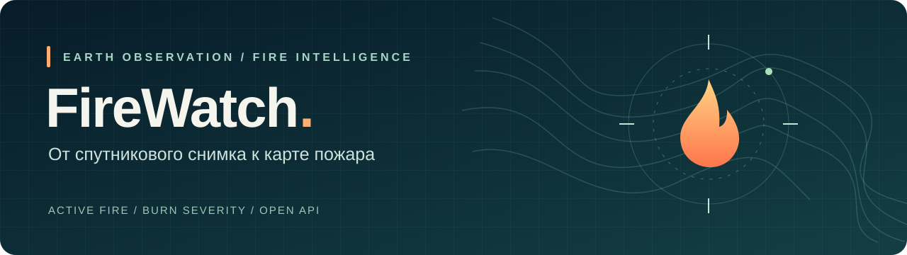
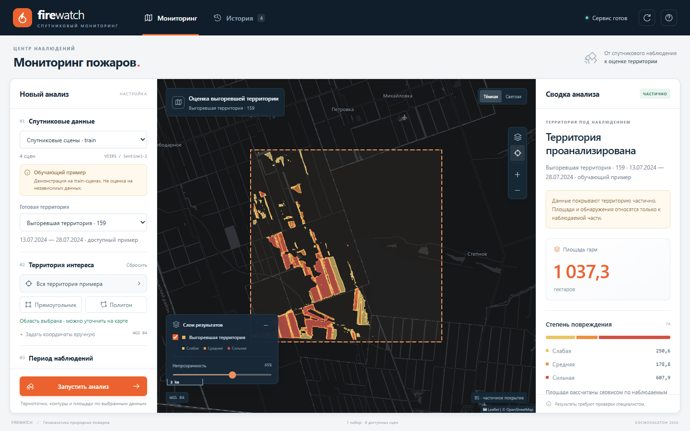
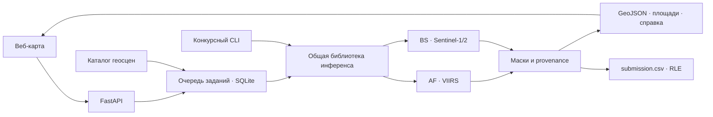

<p align="center">
  
</p>

<p align="center">
  <strong>Где горит сейчас. Что пострадало после пожара.</strong><br>
  Спутниковый мониторинг природных пожаров · КосмоХакатон 2026
</p>

<p align="center">
  <a href="#демонстрация">Демонстрация</a> ·
  <a href="#быстрый-старт">Быстрый старт</a> ·
  <a href="docs/architecture.md">Архитектура</a> ·
  <a href="README_MODEL.md">Модели</a> ·
  <a href="MODEL_API.md">API</a> ·
  <a href="docs/evaluation.md">Проверка решения</a> ·
  <a href="docs/presentation/presentation.md">Защита</a>
</p>

## Задача → решение

Термоточка отвечает на вопрос «где обнаружено горение», но не показывает весь след пожара. **FireWatch соединяет два независимых вида анализа:** активное природное горение **AF** по VIIRS и контур гари со степенью поражения **BS** по Sentinel-2, Sentinel-1 и вспомогательным слоям.

Пользователь выбирает территорию и период, запускает анализ и получает карту, площади в гектарах и файлы для дальнейшей работы в ГИС. Те же модели доступны через REST API и автономный конкурсный CLI.

| Направление | Вход | Результат |
| :--- | :--- | :--- |
| **AF · активное горение** | VIIRS + вспомогательные признаки | Маска 0/1; термоточки для геодемонстрации |
| **BS · последствия пожара** | Sentinel-2 до/после, Sentinel-1, рельеф и покров | Фон + слабая, средняя, сильная степень поражения |
| **Геосервис** | Область интереса, период, подготовленный каталог сцен | Контуры, площади, GeoJSON, растры и JSON-справка |
| **Конкурсный инференс** | Обезличенные чипы и `sample_submission.csv` | Проверенный по структуре `submission.csv` с RLE |

## Демонстрация

**[Открыть FireWatch](https://firewatch.151.247.25.189.nip.io/)** · [Swagger API](https://firewatch.151.247.25.189.nip.io/docs)

**Статус: конкурсная поставка v3.** Для обеих задач выбраны отдельные ансамбли CNN и LightGBM. Полный автономный CLI, CPU replay, публичный сервис, браузерный сценарий и откат проверены. Предыдущий v2 сохранён как резерв.

Основной конкурсный репозиторий — [GitVerse](https://gitverse.ru/hackrus.experts/kosmo-krasnoiarsk_4_th_try_106). [Зеркало на GitHub](https://github.com/foxxed20-ux/firewatch) сохраняет ту же историю разработки.



*Снимок публичного сервиса: `official-ensemble-v3`, сцена `BS_tr_000159` из открытого train/validation. 1 037,3 га гари в наблюдаемой части AOI; интерфейс явно показывает частичное покрытие. Это демонстрация работы, а не независимая оценка качества.*

Чтобы оценить решение:

1. Откройте веб-интерфейс сервиса и выберите доступный набор сцен.
2. Выберите пример из каталога либо задайте область интереса и период.
3. Запустите AF, BS или обе задачи; дождитесь завершения задания.
4. Сравните слои карты и площади; скачайте GeoJSON и JSON-справку.

**«Нет данных» не означает «нет пожара».** Покрытие наблюдений показывается отдельно от результата классификации. Демонстрационные примеры из открытого train явно помечаются; они не являются независимым тестом качества.

## Почему решение можно проверить

- **Одна библиотека инференса.** CLI и сервис используют `competition.service_bridge`: обработка данных и классы не расходятся между демонстрацией и конкурсом.
- **Изолированная валидация.** Разбиение учитывает геосетки, а для BS — также события пожаров. Test не участвует в обучении и выборе порогов.
- **Проверяемые результаты.** RLE проверяется обратным декодированием; строки CSV следуют официальному шаблону. Веса проверяются по SHA-256.
- **География с происхождением.** Геосервис работает с явно зарегистрированными сценами. Координаты и даты обезличенного теста не восстанавливаются.
- **Воспроизводимый путь.** В репозитории находятся исходники, тесты, схемы, разбиение данных и инструкции обучения. Крупные данные и веса поставляются отдельно.

## Материалы для жюри

- **Паспорт проекта:** [PDF](output/pdf/FireWatch_Project_Passport.pdf) · [Markdown](docs/PROJECT_PASSPORT.md). Цель, команда `4_th_try`, состав решения, результаты и риски.
- **Исследование предметной области:** [PDF](output/pdf/FireWatch_Domain_Research.pdf) · [Markdown](docs/DOMAIN_RESEARCH.md). Сенсоры, аналоги, требования, гипотезы и обоснование подхода.
- **Технический отчёт:** [EDA, модели и эксперименты](docs/MODEL_REPORT.md). Источники метрик и ограничения оценки.
- **Защита:** [презентация PowerPoint](docs/presentation/FireWatch_КосмоХакатон_2026.pptx) · [заметки докладчика](docs/presentation/presentation.md).
- **Соответствие заданию:** [карта требований со страницами PDF организаторов](docs/requirements.md).

## Быстрый старт

```bash
git clone https://gitverse.ru/hackrus.experts/kosmo-krasnoiarsk_4_th_try_106.git firewatch
cd firewatch
```

Для клонирования без авторизации доступно [публичное зеркало GitHub](https://github.com/foxxed20-ux/firewatch): `git clone https://github.com/foxxed20-ux/firewatch.git firewatch`. Доступ к GitVerse зависит от настроек конкурсного проекта.

### Веб-интерфейс и API

Локальные проверки выполняются на Python 3.13.5, серверная демонстрация — на Python 3.10.12. CI настроен на Python 3.11; результат его запуска нужно смотреть отдельно. Из корня репозитория:

```bash
python -m venv .venv-service
# Linux/macOS: source .venv-service/bin/activate
# Windows PowerShell: .venv-service\Scripts\Activate.ps1
python -m pip install -r requirements-service.txt
python -m uvicorn firewatch_service.api:app --host 127.0.0.1 --port 8000
```

Откройте [интерфейс](http://127.0.0.1:8000), [Swagger UI](http://127.0.0.1:8000/docs) или [OpenAPI JSON](http://127.0.0.1:8000/openapi.json).

Этот запуск поднимает приложение. **Для анализа нужны [веса](#готовые-веса-v3) и каталог сцен:** по умолчанию `model_bundle/` и `data/service/`. Без них приложение сообщает о неготовности, а не создаёт фиктивные предсказания. Пути настраиваются через `FIREWATCH_MODEL_ROOT` и `FIREWATCH_DATA_ROOT`; остальные настройки — в [конфигурации сервиса](firewatch_service/config.py). Для bundle с CNN дополнительно установите CPU-сборку PyTorch: `python -m pip install -r deploy/requirements-cpu.txt`. Подготовка каталога, работа с API, развёртывание и откат описаны в [README_SERVICE.md](README_SERVICE.md).

### Конкурсный инференс

Модельное окружение создаётся отдельно от сервисного:

```bash
python -m venv .venv-model
# Активируйте .venv-model средствами вашей ОС.
python -m pip install -r requirements-model.txt
python inference.py --data-dir /path/to/test --model-dir /path/to/model_bundle --output submission.csv
```

Входной каталог должен содержать официальный `sample_submission.csv`; альтернативный путь задаётся через `--sample-submission`. Данные и веса размещаются заранее: инференс не требует сети. Подготовка train, обучение CNN/LightGBM и выбор модели описаны в [README_MODEL.md](README_MODEL.md).

Ожидаемая структура входов (имена чипов приведены как примеры):

```text
test/
├── sample_submission.csv
├── af/
│   ├── viirs/AF_te_000001_VIIRS_I1-I5.tif
│   └── aux/AF_te_000001_AUX.tif
└── bs/
    ├── sentinel2_pre/BS_te_000001_Sentinel-2_pre.tif
    ├── sentinel2_post/BS_te_000001_Sentinel-2_post.tif
    ├── sentinel1_pre/BS_te_000001_Sentinel-1_pre.tif
    ├── sentinel1_post/BS_te_000001_Sentinel-1_post.tif
    └── aux/BS_te_000001_AUX.tif
```

Загрузчик ищет файлы рекурсивно и проверяет суффиксы, каналы, размеры и геосетки. Передавайте один каталог train или test; дубликаты чипов отклоняются. Результат появляется в пути `--output`: UTF-8 CSV с заголовком `chip_id,class_id,rle` и **447 строками данных** для официального тестового шаблона.

### Обучение

```bash
python -m competition.prepare --data-dir data/train --output prepared --split artifacts/split.json
python train.py --records prepared/records.json --output runs/cnn-v1 --task af --epochs 80 --batch-size 8 --time-limit-min 14 --workers 1 --seed 42
python train.py --records prepared/records.json --output runs/cnn-v1 --task bs --epochs 120 --batch-size 2 --time-limit-min 43 --workers 1 --seed 42
```

Это команды CNN-кандидата, а не обещание одинакового числа эпох при ограничении по времени. Вариант LightGBM и процедура выбора весов описаны в [модельной инструкции](README_MODEL.md). Bundle содержит `manifest.json` и перечисленные в нём файлы весов; он подключается через `--model-dir` для CLI и `FIREWATCH_MODEL_ROOT` для сервиса.

### Готовые веса v3

[Скачать `official-ensemble-v3.zip`](https://firewatch.151.247.25.189.nip.io/downloads/official-ensemble-v3.zip) — 14 366 427 байт; только веса и manifest, без спутниковых данных. Адрес закреплён за этой версией. Из корня проекта:

```bash
curl --fail --location https://firewatch.151.247.25.189.nip.io/downloads/official-ensemble-v3.zip --output official-ensemble-v3.zip
python -c "import hashlib; from pathlib import Path; p=Path('official-ensemble-v3.zip'); assert hashlib.sha256(p.read_bytes()).hexdigest() == 'bff193672985cbdc5e74a793d91d2224cd887965c6e4497b656523997cac2880', 'SHA-256 mismatch'; print('SHA-256 OK')"
python -m zipfile -e official-ensemble-v3.zip model_bundle
python -c "from competition.service_bridge import describe_models; s=describe_models('model_bundle'); print(s); assert s['available']"
```

В Windows PowerShell используйте `curl.exe`. Распаковывайте в новый каталог `model_bundle`, чтобы не смешивать версии. Сырые маски v3 совпали побайтово на Windows и Linux CPU. Полный автономный прогон обработал 269 чипов и сформировал 447 строк данных с заголовком за 390,7 с на GPU T4. Повторный CPU-инференс всех 129 validation-чипов воспроизвёл три метрики без изменения. Это повтор сохранённых весов, не повтор обучения с нуля; замер CLI выполнялся при параллельном CPU replay и не является испытанием организаторов. [Доказательства и условия](docs/evaluation.md).

## Архитектура



**Стек:** Python · NumPy · LightGBM · PyTorch · FastAPI · Rasterio · Shapely · PyProj · SQLite · JavaScript · Leaflet. Фронтенд раздаётся самим API и не требует npm-сборки.

Подробнее: [границы компонентов и потоки данных](docs/architecture.md), [контракт API](MODEL_API.md).

## Качество и воспроизводимость

Официальная формула:

```text
Score = 0.35 × F1_AF + 0.35 × IoU_burn + 0.30 × mIoU_severity
```

Для разработки используются **644 train-чипа**: 420 AF и 224 BS. Зафиксированный split — **515 train / 129 validation**: AF 336/84, BS 179/45. Подробности: [разбиение](artifacts/split.json), [аудит данных](artifacts/data_inspection.json).

| Кандидат | F1 AF | IoU гари | mIoU степени поражения | Validation Score |
| :--- | ---: | ---: | ---: | ---: |
| LightGBM v1 | 0,9021 | 0,5494 | 0,5549 | 0,6745 |
| AF: CNN + LightGBM; BS: LightGBM с настроенной постобработкой, v2 | 0,9295 | 0,5768 | 0,5851 | 0,7027 |
| AF и BS: ансамбли CNN + LightGBM, v3 | **0,9295** | **0,5867** | **0,5884** | **0,7072** |

**Это validation, не закрытый тест.** Пороги, доля ансамбля и множители классов выбраны на этой же выборке; результат может быть оптимистичным. Прирост v3 над v2 равен 0,00446; условный bootstrap-интервал включает ноль и не учитывает выбор рецепта. Источники и анализ ошибок — в [техническом отчёте](docs/MODEL_REPORT.md); методика и доказательства — в [протоколе оценки](docs/evaluation.md).

### Проверки

```bash
# В модельном окружении
python -m pytest -q tests/test_competition_contract.py tests/test_tree_contract.py tests/test_model_runtime_contract.py tests/test_training_shapes.py tests/test_postprocess_tuning.py

# В сервисном окружении; тестовые зависимости устанавливаются отдельно
python -m pip install pytest httpx
python -m pytest -q tests/service

# Node.js нужен только для проверки frontend
node --check web/app.js
node --test tests/frontend/core.test.cjs
```

Контрактные тесты проверяют форматы, RLE, метрики, обработку ошибок и геоэкспорт. Полный инференс на данных и сквозная проверка развёрнутого сервиса выполняются отдельно: unit-тесты их не заменяют.

## Навигация по репозиторию

| Путь | Что находится внутри |
| :--- | :--- |
| [`competition/`](competition/) | Чтение сенсоров, признаки, модели, обучение, метрики, RLE, bridge |
| [`inference.py`](inference.py), [`train.py`](train.py) | Точки входа конкурсного инференса и обучения |
| [`firewatch_service/`](firewatch_service/) | API, каталог, задания, геообработка |
| [`web/`](web/) | Карта и интерфейс без отдельной сборки |
| [`tests/`](tests/) | Контрактные, сервисные и frontend-проверки |
| [`deploy/`](deploy/) | Подготовка и развёртывание сервиса |
| [`docs/`](docs/) | Архитектура и протокол оценки |
| [`docs/requirements.md`](docs/requirements.md) | Требования конкурса со страницами первоисточников |
| [`README_MODEL.md`](README_MODEL.md) | Входы моделей и воспроизведение обучения |
| [`README_SERVICE.md`](README_SERVICE.md) | Каталог геосцен, API, развёртывание и откат |
| [`MODEL_API.md`](MODEL_API.md) | Спецификация взаимодействия с моделями |
| [`docs/MODEL_REPORT.md`](docs/MODEL_REPORT.md) | EDA, сравнение моделей, постобработка и ограничения |
| [`docs/PROJECT_PASSPORT.md`](docs/PROJECT_PASSPORT.md) | Паспорт проекта, состав команды и проверенные результаты |
| [`docs/DOMAIN_RESEARCH.md`](docs/DOMAIN_RESEARCH.md) | Исследование предметной области и обоснование решений |
| [`docs/presentation/`](docs/presentation/) | Редактируемая презентация на 10 слайдов и заметки для защиты |
| [`CHANGELOG.md`](CHANGELOG.md) | Проверенные этапы развития |
| [`CONTRIBUTING.md`](CONTRIBUTING.md) | Правила изменений и проверки перед коммитом |

## Данные и границы применения

Источник конкурсных данных — [открытый каталог организаторов](https://disk.yandex.ru/d/-rpmevTflbXZQg). Данные, веса, локальные ключи и служебные окружения не включаются в Git. Условия исходных данных сохраняются при использовании; публикация исходников не меняет права на сторонние материалы. Атрибуция библиотеки карты и источников — в [THIRD_PARTY.md](THIRD_PARTY.md).

FireWatch — конкурсный исследовательский прототип. Результат зависит от доступных сцен, облачности, разрешения сенсоров и качества моделей. Использование для оперативных решений требует отдельной полевой проверки и эксплуатационной приёмки.
