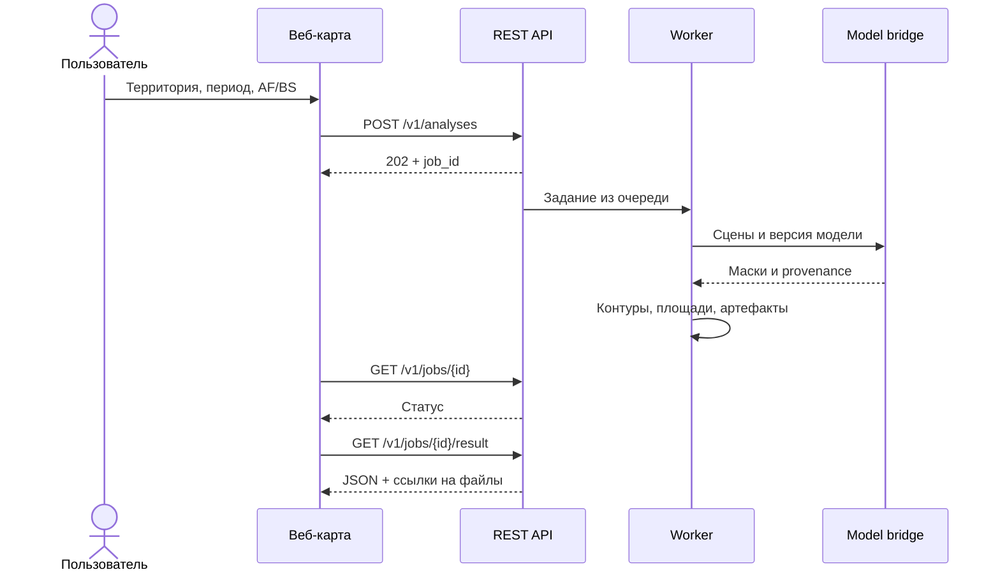

# Архитектура FireWatch

[← Главная](../README.md) · [Контракт API](../MODEL_API.md) · [Модели](../README_MODEL.md)

## Два пути к одному инференсу

Конкурсный CLI читает обезличенные чипы и формирует CSV. Геосервис принимает область интереса и период, выбирает сцены из разрешённого каталога и преобразует маски в географические результаты. Оба пути вызывают общую модельную библиотеку.

| Компонент | Ответственность | Контракт |
| --- | --- | --- |
| `competition.data` | Проверка каналов, единиц и геосеток; построение признаков | Входные данные AF/BS без чтения test-разметки |
| `competition.service_bridge` | Загрузка и проверка bundle, вызов модели | `class_map`, `observation_valid`, score и происхождение |
| `competition.rle` | Кодирование и декодирование | C-order, индексация с 1, отдельная строка на класс |
| `inference.py` | Сверка шаблона, порядок строк, атомарная запись CSV | Официальный `sample_submission.csv` |
| `firewatch_service.api` | HTTP, валидация, ограничения запросов, выдача артефактов | `/openapi.json`, `/v1/*` |
| `firewatch_service.jobs` | Очередь, статусы, идемпотентность и таймауты | SQLite; изолированное выполнение |
| `firewatch_service.catalog` | Явный список доступных геосцен | `datasets/*/manifest.json` |
| `firewatch_service.processing` | AOI, временная фильтрация, векторизация, площади | GeoJSON, GeoTIFF и JSON |
| `web/` | Выбор запроса, ход задания, карта и экспорт | Те же API-результаты, что у внешнего клиента |

## Запрос на анализ

## Геопространственные правила

- Публичный геокаталог и обезличенный конкурсный test разделены. Результат CLI не требует восстановления координат или дат.
- AOI задаётся в WGS84: долгота, затем широта. Допустимы bbox, Polygon и MultiPolygon согласно схеме API.
- Для AF период относится ко времени наблюдения; для BS — к дате post. API использует полуоткрытый интервал `[start, end)`.
- Площади вычисляются геопространственной обработкой; нельзя умножать число пикселей на площадь градусной ячейки.
- Перекрывающиеся BS-наблюдения не должны суммировать один и тот же участок многократно.
- Служебный NoData 255 не является классом пожара. В конкурсном CSV допустимы только официальные классы.

Точные поля запросов и ответов находятся в [MODEL_API.md](../MODEL_API.md); актуальная машинная схема — `/openapi.json` запущенного сервиса.

## Развёртывание

Один API-процесс обслуживает статические файлы и запросы; очередь сохраняется в SQLite. Это компактная конфигурация для ограниченного демонстрационного каталога. Масштабирование на множество исполнителей и эксплуатация с высокой доступностью требуют отдельной работы.

Данные, bundle, база заданий и результаты размещаются отдельно от исходников. В [deploy/](../deploy/) находятся шаблоны окружения, reverse proxy и упаковка релиза. Настоящие токены и SSH-материалы хранятся вне Git.
